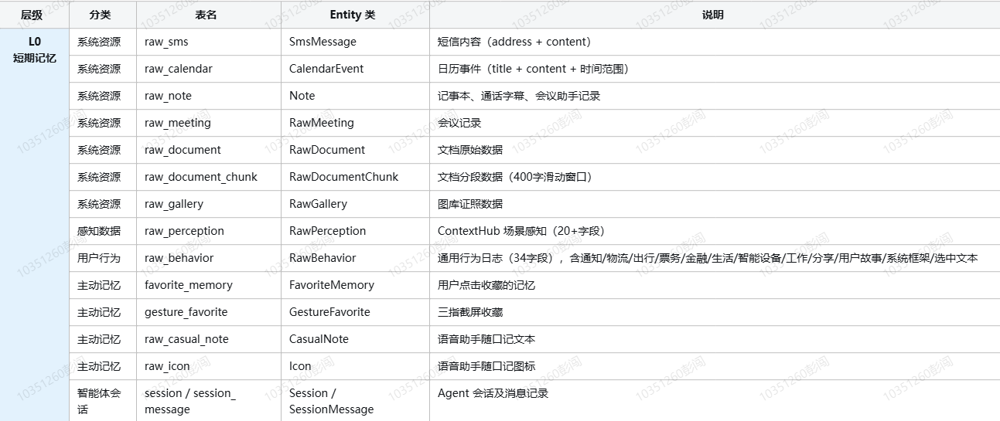
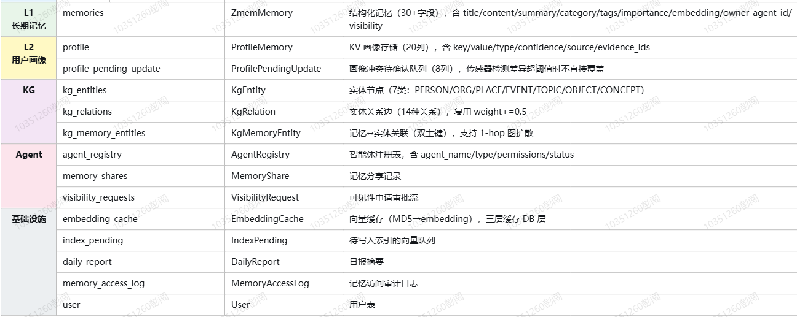

项目综述：

2024年8月-11月

1、云端大模型log分析部署

部门研发提效任务，需要研发一个log分析系统，帮助用户进行手机log的分析、关键词提取、有效问答等项目，帮助用户解决log相关分析等项目，具体为：

（1）用户输入一个log的日志和故障的相关描述，根据用户的日志和相关的描述定位相关的log。找出故障log的关键词，并输出相应的log，支持log的窗口二次问答，用户通过问答的方式，能够二次对log进行相关的定位和解答。

（2）系统分析：批量对log进行相关的分析，将log的分析分为，意图识别、文件夹意图提取、数据预处理、数据定位，上下文分析、大模型分析，结论得出，每一步都设置了相应的前端页面代码，将其规整化输出，并设置了相关的进度条，保证数据的后台稳定输出。

具体的做法为：

（1）用户输入对应的log文件。

（2）采用关键词词库进行区分分析。根据故障类型，故障大概分为：

wifi连接问题、异常断开问题、网络问题、连接问题、 死机5类，5类先使用关键词进行初筛，将其划分到对应的故障领域。 这边数据集大概300来看，分布不均衡，每个类别80-100多不等。

（3）数据清洗和入库，用户上传的是个对应的log压缩包，这边需要先对log进行解压，解压后根据对应的log分类寻找对应的文件夹，比如 

第一步：文件夹定位： logcat:为系统应用、系统服务等相关类型的日志。对应上面的wiif连接、异常断开、网络问题、连接问题等，kernel内核则对应的相应的死机问题。Modem**射频 / 基带日志**：手机通信模块，通话、SIM、4G/5G、信号、VoLTE等日志作为连接问题的辅助。

日志合并：采用合并脚本将多个log文件合并为1个进行统一分析。

第二步：log定位，使用故障描述的时间，找出日志中对应的日志节点。其次使用专人使用的关键词进行相关日志的节点，使用公司已经训练好的星云大模型进行日志的理解和解析，得到模型的分析结果。

第三步：关键词定位，由我司的专门的日志解析人员，通过关键词匹配算法，匹配上下文的关键词，当然页面也支持相关关键词的添加按钮。用户除了本身的关键词传输以外还支持人工的关键词输入。

第四步：rag功能，除了上述可以直接分析log以外，我们还对log进行了相关的清洗，由专门的人员将log和对应的问题分析组成了数据集，分析的主要片段包括：1、关键日志、错误原因、log原文，将得到的片段使用向量数据库存储在es上，采用fassi+向量检索的方式作为一个专门的知识数据，然后这里采用

难点：

（1）如何选择模型让其能够快速的理解手机的日志。这边对比了很多模型，包括qwen-72b模型，公司的星云模型 72b和128k超长，这里单纯使用日志的问题解析的选择题的方式，分别检测了模型的性能。最终从公司的6个模型中选择了两个，一个是上下文能力最长的模型，一个是模型理解能力最好的模型。在初步混合分析的时候采用对log理解能力最好的模型去进行判断和回答，问答长度超过一定范围的时候则采用128k的模型进行混合问答，确保模型对长问答的理解能力。

（2）加入了rag的检索能力，这里采用了最新的bge模型对输入的文本进行了embedding,拼接的方式主要为问题+答案,当时使用的仍然是bge的全家桶，bge+bge reranker,bge进行检索，bge reranker进行重排，将重排后的结果返回给大模型进行进一步的回答。

难点：（1）这样做的好处是不需要预调整大模型，只需要通过检索增强的方式便可以很轻松得到对应参考答案，防止模型走偏。但难点是不同的故障对应的问题是不一样的，检索的内容反而会污染大模型的思考。

但是实际的测试过程中遇到了很多检索不准确，大模型的回答容易受到干扰的问题：

归结起来的原因如下：
（1）检索的领域过大：5类故障（wifi/断开/网络/连接/死机）共用一个向量库，这样检索产生错乱，如wifi问题检索到死机问题，会产生天然的跑偏。

（2）更新了检索的输入和匹配的输入，log日志检索，一开始使用的问题是 故障日志和用户描述，这样检索的长度较长，且用户描述不是标准的描述，如 用户输入的是手机老断网+log日志，这里我是对用户的描述进行规整化处理，如

手机老是断网（口语化严重），这里采用大模型让其变成技术性话语，然后采用关键词匹配的策略，给出命中的关键词，让大模型生成几条关键的技术性假设，使用规整的技术话语+关键词命中得到的技术假设进行多路并排检索，得到相应的检索片段

（3）reranker置信度判断：多路检索后对结果进行重排，使用reranker对检索到的结果按照对应的置信度阈值进行筛选和重排，第二，采用prompt限制，在重排以后对输入给大模型时，在其中给出明确提示，让大模型自己选择跟当前故障或者问题相关的片段。无关的不要纳入模型进行相关的思考。

（4）chunk切分，检索库中的日志切分主要采用专人切分，入库时对日志中的无关数据进行了清理，主要包含日志前 时间 应用 等系统提示的数据。尽可能确保数据规整且长度不超过embedding的长度。

项目2：音乐生成

项目背景：公司想发布一个音乐手机，通过用户哼唱一部分的歌曲，利用端侧模型给用户续上一段音乐，在原有的哼唱背景下通过模型生成得到一部分的续写音频。然后合并成一个完整的音频提供给用户用做手机铃声。

项目3：记忆项目

具体为公司希望做一个有关于记忆的系统，能够记录用户以往的事件和记忆，根据用户的输入内容检索并召回用户的相关记忆。

1、表的设计

记忆数据均采用表的方式存储在手机的数据库中。记忆大致可以分为三类：L0短期记忆、L1长期记忆、L2用户画像、KG（知识图谱）、AGENT这5大块。

