项目综述：

2024年8月-11月


# 1、云端大模型log分析部署

部门研发提效任务，需要研发一个log分析系统，帮助用户进行手机log的分析、关键词提取、有效问答等项目，帮助用户解决log相关分析等项目，具体为：

（1）用户输入一个log的日志和故障的相关描述，根据用户的日志和相关的描述定位相关的log。找出故障log的关键词，并输出相应的log，支持log的窗口二次问答，用户通过问答的方式，能够二次对log进行相关的定位和解答。

（2）系统分析：批量对log进行相关的分析，将log的分析分为，意图识别、文件夹意图提取、数据预处理、数据定位，上下文分析、大模型分析，结论得出，每一步都设置了相应的前端页面代码，将其规整化输出，并设置了相关的进度条，保证数据的后台稳定输出。


具体的做法为：

（1）用户输入对应的log文件。

（2）采用关键词词库进行区分分析。根据故障类型，故障大概分为：

wifi连接问题、异常断开问题、网络问题、连接问题、 死机5类，5类先使用关键词进行初筛，将其划分到对应的故障领域。 这边数据集大概300来看，分布不均衡，每个类别80-100多不等。

（3）数据清洗和入库，用户上传的是个对应的log压缩包，这边需要先对log进行解压，解压后根据对应的log分类寻找对应的文件夹，比如 

第一步：文件夹定位： logcat:为系统应用、系统服务等相关类型的日志。对应上面的wiif连接、异常断开、网络问题、连接问题等，kernel内核则对应的相应的死机问题。Modem**射频 / 基带日志**：手机通信模块，通话、SIM、4G/5G、信号、VoLTE等日志作为连接问题的辅助。

日志合并：采用合并脚本将多个log文件合并为1个进行统一分析。

第二步：log定位，使用故障描述的时间，找出日志中对应的日志节点。其次使用专人使用的关键词进行相关日志的节点，使用公司已经训练好的星云大模型进行日志的理解和解析，得到模型的分析结果。

第三步：关键词定位，由我司的专门的日志解析人员，通过关键词匹配算法，匹配上下文的关键词，当然页面也支持相关关键词的添加按钮。用户除了本身的关键词传输以外还支持人工的关键词输入。

第四步：rag功能，除了上述可以直接分析log以外，我们还对log进行了相关的清洗，由专门的人员将log和对应的问题分析组成了数据集，分析的主要片段包括：1、关键日志、错误原因、log原文，将得到的片段使用向量数据库存储在es上，采用fassi+向量检索的方式作为一个专门的知识数据，然后这里采用


难点：

（1）如何选择模型让其能够快速的理解手机的日志。这边对比了很多模型，包括qwen-72b模型，公司的星云模型 72b和128k超长，这里单纯使用日志的问题解析的选择题的方式，分别检测了模型的性能。最终从公司的6个模型中选择了两个，一个是上下文能力最长的模型，一个是模型理解能力最好的模型。在初步混合分析的时候采用对log理解能力最好的模型去进行判断和回答，问答长度超过一定范围的时候则采用128k的模型进行混合问答，确保模型对长问答的理解能力。

（2）加入了rag的检索能力，这里采用了最新的bge模型对输入的文本进行了embedding,拼接的方式主要为问题+答案,当时使用的仍然是bge的全家桶，bge+bge reranker,bge进行检索，bge reranker进行重排，将重排后的结果返回给大模型进行进一步的回答。

难点：（1）这样做的好处是不需要预调整大模型，只需要通过检索增强的方式便可以很轻松得到对应参考答案，防止模型走偏。但难点是不同的故障对应的问题是不一样的，检索的内容反而会污染大模型的思考。

但是实际的测试过程中遇到了很多检索不准确，大模型的回答容易受到干扰的问题：

归结起来的原因如下：
（1）检索的领域过大：5类故障（wifi/断开/网络/连接/死机）共用一个向量库，这样检索产生错乱，如wifi问题检索到死机问题，会产生天然的跑偏。

（2）更新了检索的输入和匹配的输入，log日志检索，一开始使用的问题是 故障日志和用户描述，这样检索的长度较长，且用户描述不是标准的描述，如 用户输入的是手机老断网+log日志，这里我是对用户的描述进行规整化处理，如

手机老是断网（口语化严重），这里采用大模型让其变成技术性话语，然后采用关键词匹配的策略，给出命中的关键词，让大模型生成几条关键的技术性假设，使用规整的技术话语+关键词命中得到的技术假设进行多路并排检索，得到相应的检索片段

（3）reranker置信度判断：多路检索后对结果进行重排，使用reranker对检索到的结果按照对应的置信度阈值进行筛选和重排，第二，采用prompt限制，在重排以后对输入给大模型时，在其中给出明确提示，让大模型自己选择跟当前故障或者问题相关的片段。无关的不要纳入模型进行相关的思考。

（4）chunk切分，检索库中的日志切分主要采用专人切分，入库时对日志中的无关数据进行了清理，主要包含日志前 时间 应用 等系统提示的数据。尽可能确保数据规整且长度不超过embedding的长度。


# 音乐生成

## 1、项目背景和难点

### 1.1 项目背景

公司想发布一个音乐手机，通过用户哼唱一部分的歌曲，利用端侧模型给用户续上一段音乐，在原有的哼唱背景下通过模型生成得到一部分的续写音频。然后合并成一个完整的音频提供给用户用做手机铃声。

### 1.2 难点

这个项目的主要难点在，输入为一个人的哼唱，输出为一个歌曲（midi音乐），如何让模型理解这个人的哼唱旋律，其次，如何让旋律整体能更好听一点。

所以，这里设计的整体的项目步骤为。

输入人声->人声转midi->midi音乐节奏增强->mkvw音乐生成模型->生成时间限制（生成5s、10s、15s、30s、60s）->呈现给用户。


### 1.3 难点与解决

1、调研：目前这个当时的想法就是选择一个开源模型，通过对开源模型进行加工和处理，从而得到对应的midi音乐，但是当时从人声转为midi以后会发现，整体的midi旋律音色单调、旋律不足， 这样喂入的模型的数据较差。输出的结果就较差。2、其次，当时选择的基准开源模型为rwkv，因为当时对比网络上的多个开源的midi模型，这个是纯rnn生成，即属于输入midi，生成midi。其次，这个当时在各个网站上的评分较好。 选择后要做的就是对这个模型进行量化和测试，量化的主要步骤就是将其转为onnx,当时采用的torch转onnx,转换完成后我们下载了几个经典的midi音乐进行截断，使用模型进行生成，发现模型存在重复出音的情况，比如生成到后面音色突然拉长，或者陷入死循环的清理。3、最后, rwkv整体的框架为rnn框架，所以在生成5s-15s的音乐的时候就还好，但是当生成的数据很多的时候,生成的时间较慢，需要1分钟到1分半，所以这边优化生成的速度。


#### 1、数据问题：midi音乐

midi音乐当时的做法主要分为两个方向：

（1）自己搜集数据集，通过淘宝购买，线上数据爬取获取大量的丰富的midi音乐。

（2）爬取，对相关的免费的midi网站进行midi音乐的爬取。 通过这两个手段大致获取了60w首左右的midi音乐集。

#### 2、数据转换问题。

人声转midi，其实就是分解人的声音转换问题，一开始采用的basic-pitch模型,这个是个cnn模型，具体的是以cnn模型为基础，通过梅尔特征提取，将其转换为pitch激活码和onset、offset的形式。但是做出来会有几个不好的地方，1、人声中一些气声（说话人的哈气）等声音会导致噪声midi的出现。2是转换midi旋律不连贯问题，人声发声时由于是人声说话或者说唱的问题，天然不可能整体的音节都是连贯的，所以一开始转换的midi音乐也是有问题。为了解决这些问题，这里改进了basic-pitch模型，输入不仅使用了梅尔频谱的特征提取，还采用了常数Q变换，共同提取音频特征。消除人的哈气、叹气等气息的噪声。

##### （1）梅尔频谱的原理

声音在进入电脑后是一系列的波形序列，如：

[x1，x2,x3.....]

每个xi代表第i时刻的空气震动幅度。加入采样频率16khz，代表每秒记录1W6000个点，这里使用8Khz，即每秒记录8000个点，

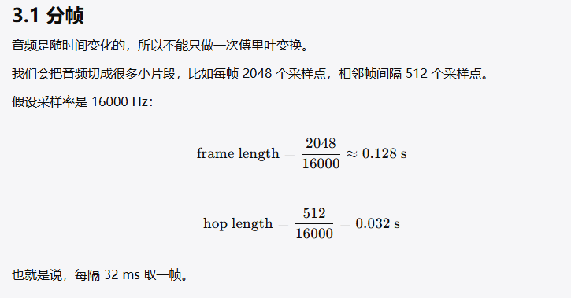


##### 对每一帧做傅里叶变换

每一小帧都做 FFT，得到这一小段时间里的频率能量分布。

结果可以理解成：

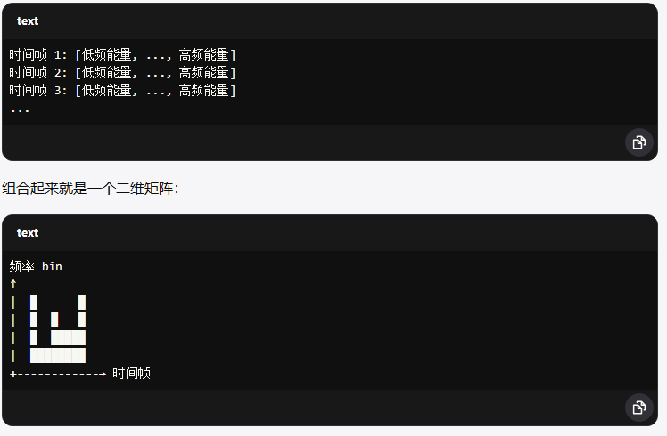

那么傅里叶变换是如何将时间序列转为能量的呢。这里就是用傅里叶变换，你可以理解为就是一个数学解码公式，将复杂的原始波形变换为了更为简单的分布。

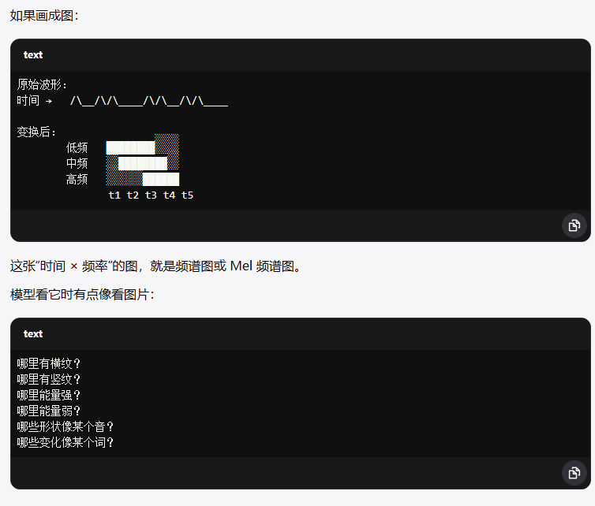

#####  梅尔频谱矩阵

梅尔频谱其实就是将声音真实频率转换为了人耳能够听到的梅尔频率，你可以想象成做了一个坐标变换，因为人耳的听觉范围和自然界的真实声音是不同的。注意梅尔的声音频率分级只有128级，假设我们取了312帧的声音的话，基本的矩阵就是 [312,128],大致如下：

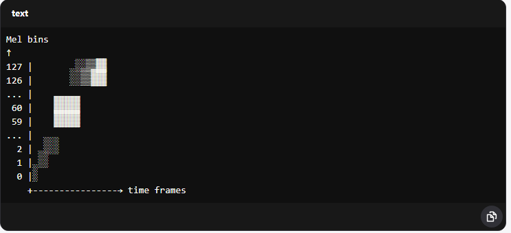

所以后面接了CNN，其实就是将声音看成一张图片一样去进行处理。得到对应的音高，力度，音节的开始和结束时间。

所以这个本质上还是在做一个多标签的预测模型，预测这一帧的音高大致多少，这一桢的力度大概在多少，这一帧的开始和结束时间大致在多少。


##### 加入常数q变换，增强人声的特征提取

首先人声会有很多干扰：

主旋律基频 F0
泛音
气声 
齿音
爆破音 
混响
和声/叠唱

如果只看mel频谱，它可能会：

泛音当成基频
和声当成主旋律
气声当成音符起点
齿音当成高频音高变化

即会将其中的干扰音乐提取出来，当作主要的旋律音节。这就导致输出的midi音乐不稳定。

##### mel频谱的缺点：

（1）一般来说，一个mel滤波可能覆盖几百HZ,但是人的高音区绝对频率相差较大，需要显著区分，如：

A4 440 Hz
A#4 466.16 Hz
B4 493.88 Hz
C5 523.25 Hz

这些mel是区分不了的。所以mel对音区相差频率较大的音节转换效果不好。

（2）mel会把将一个范围内频率都加权求和成一个mel单位，这也意味着很多成分会落在同一个 Mel 频带里：

```text
主音的泛音
和声的基频
气声的高频噪声
齿音的高频能量
混响尾音
```

这样做，模型无法很好的区分哪些是

```
这是稳定的基频？
还是气声？
还是和声？
还是某个泛音？
```

总体来说，mel对音节、音色、发音方式比较友好，但对精细音高不够理想。

CQT对音高、谐波结构、音乐音符位置更友好。Mel 频谱擅长表达人声的音色、音节能量和发音结构；

CQT 擅长表达音乐音高和谐波结构。引入 CQT 可以弥补 Mel 在精细音高分辨和 MIDI 音符对齐上的不足，从而让模型在气声、和声和泛音干扰下更稳定地提取音高与音节相关特征。

##### CQT的原理：

还是一样，输入的音频大致长这样：

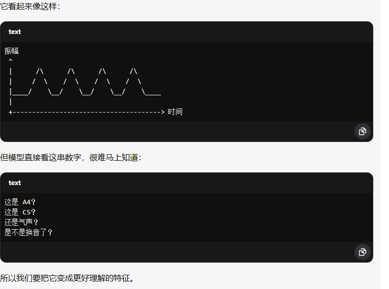

假设某个人唱了一个很长的音：A4

它的频率是：440HZ

大致意思是空气每秒震动440次,这串数字为

```text
0.00, 0.17, 0.34, 0.49, 0.64, 0.76, ...
```

CQT 做的事情就是：看这串数字中是否有A4。那么音乐的分布频率为：

```
A3 = 220 Hz
A4 = 440 Hz
A5 = 880 Hz
```

每升高一个八度，频率乘以 2。

所以 CQT 使用的是这种频率格子：

```
A3     220.00 Hz
A#3    233.08 Hz
B3     246.94 Hz
C4     261.63 Hz
C#4    277.18 Hz
D4     293.66 Hz
D#4    311.13 Hz
E4     329.63 Hz
F4     349.23 Hz
F#4    369.99 Hz
G4     392.00 Hz
G#4    415.30 Hz
A4     440.00 Hz
A#4    466.16 Hz
B4     493.88 Hz
C5     523.25 Hz
```

那什么是常数q呢：

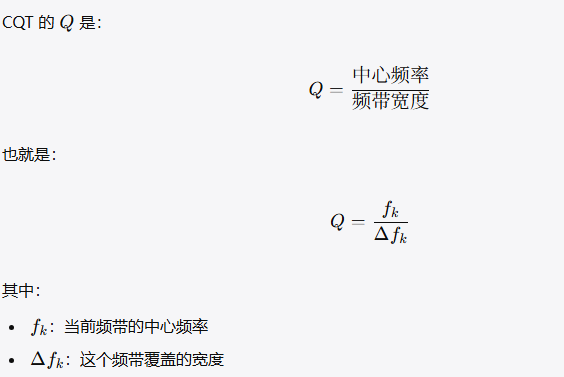

注意这个公式，这个代表低音的覆盖面小，高音的覆盖率宽。例如：

```
低频 100 Hz 附近：
中心频率 100 Hz
带宽约 6 Hz
覆盖 97 Hz 到 103 Hz

中频 1000 Hz 附近：
中心频率 1000 Hz
带宽约 60 Hz
覆盖 970 Hz 到 1030 Hz

高频 5000 Hz 附近：
中心频率 5000 Hz
带宽约 300 Hz
覆盖 4850 Hz 到 5150 Hz
```

反正大致的理解为：

CQT 是把每一帧音频投影到一组按音乐音高排列的频率格子上，得到“每个时间帧 × 每个音高频带”的能量矩阵。
如果某一帧主要是 A4，那么 A4 附近的 CQT bin 会比较亮，同时它的泛音位置也可能会亮。

比如你通过旋律和时间步得到的矩阵大致为：

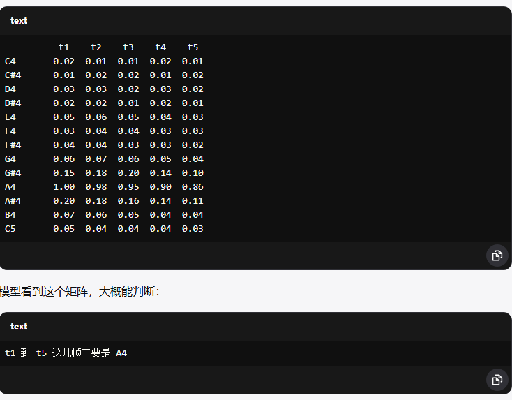

而且也不是点亮，大致的意思检测不同音域下的一个能量波动。

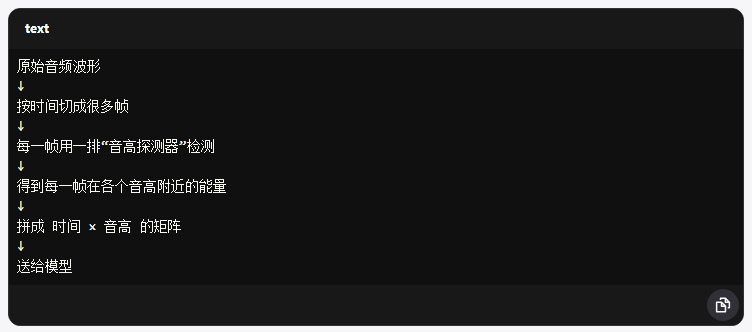

##### Q的核心意义：

Q 越大：频率分辨率越高，时间分辨率越低。
Q 越小：时间分辨率越高，频率分辨率越低。

Q 大：更看得清“是什么音高”，但看不清“什么时候变化”
Q 小：更看得清“什么时候变化”，但看不清“具体是什么音高”

Q的大小是让模型观测的越仔细（看的范围小），还是越粗心（看的范围大）

这里举个例子：

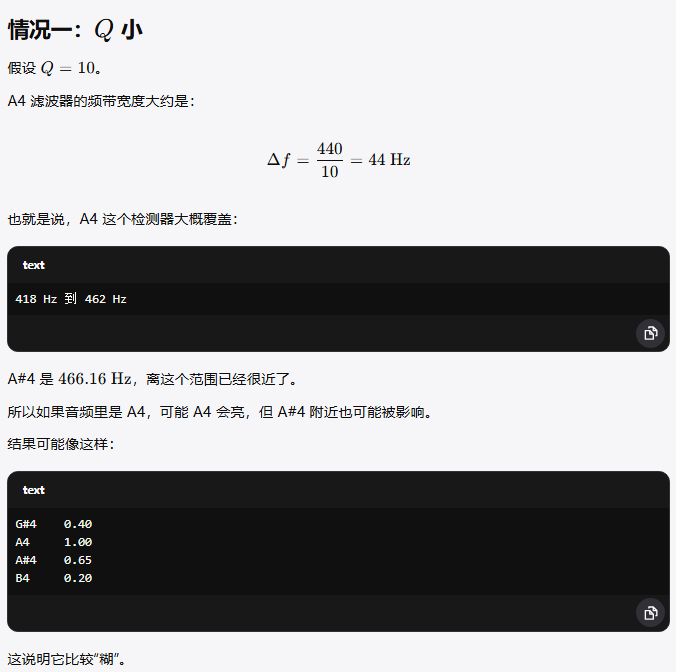

可以看出A4和周围的音节区分不是非常明显。

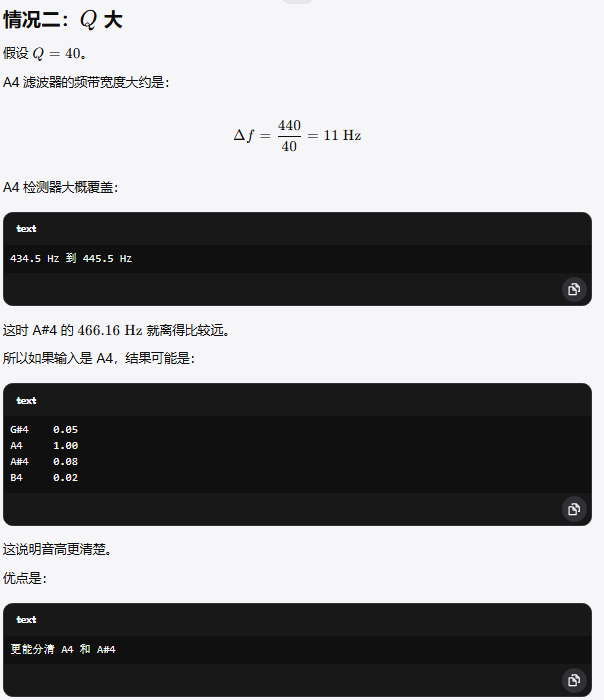

Q大的时候，模型对的音区分的就更加明显了。

Q 控制的是“音高精细度”和“时间清晰度”的取舍。
Q 大，就像用很细的尺子量音高，但需要听更长时间；
Q 小，就像快速扫一眼声音变化，时间反应快，但音高没那么精确。

##### 为什么两者结合

所以这里采用mel频谱变化和常数q采集其实就是一种互相弥补的作用,mel频谱抓取其中的人声、和声、气声等常规的音节结构，也就是人哼唱的主要声音。而常数q更加偏向于对其中的音乐节奏的特征进行抽取，两者从不同的方向相互互补，得到对应的元素，然后使用矩阵拼接，送入CNN中并得到对应的音节序列。


项目3：记忆项目

具体为公司希望做一个有关于记忆的系统，能够记录用户以往的事件和记忆，根据用户的输入内容检索并召回用户的相关记忆。


1、表的设计

记忆数据均采用表的方式存储在手机的数据库中。记忆大致可以分为三类：L0 短期记忆、L1长期记忆、L2用户画像、KG（知识图谱）、AGENT这5大块。

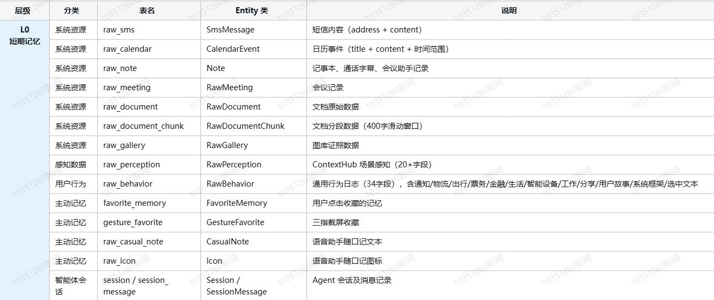

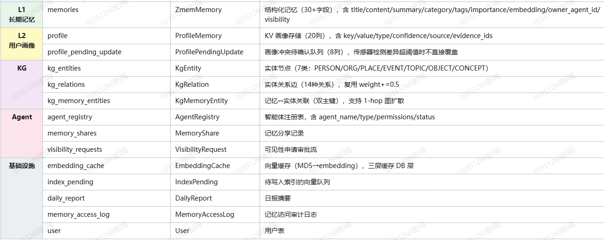

短期记忆，主要包括：短信内容、日历事件、（记事本、通话字幕、时间范围）、会议相关记录、文档原始数据、文档分块数据、系统资源（图库图片）、感知相关数据、用户行为数据（通知、物流、出行、选中文本）等、主动记忆（用户点击收藏的记忆、三指截屏收藏、语音助手随口计文本、大模型对话及其消息）。


长期记忆：

用户画像：由短期记忆长期沉淀下来的记忆。


