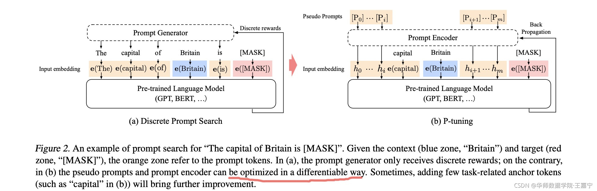
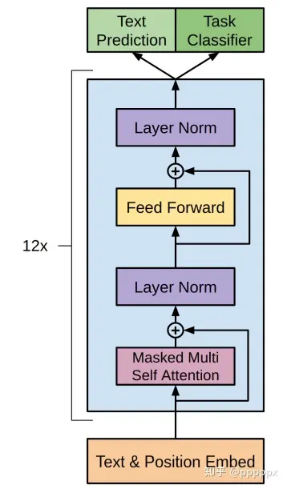
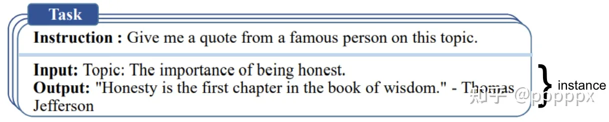
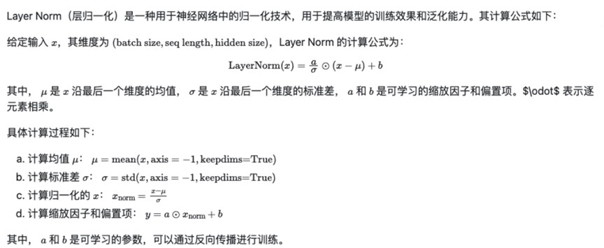
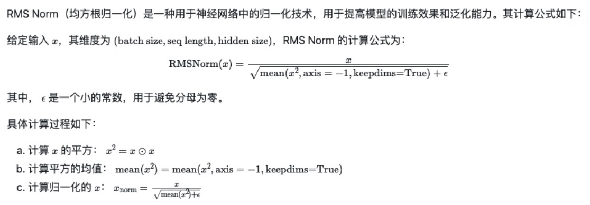
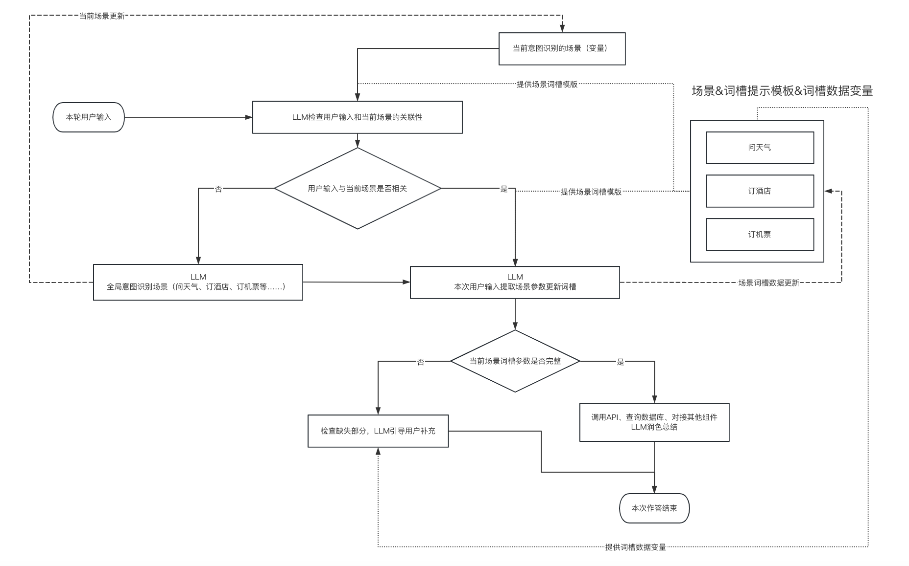
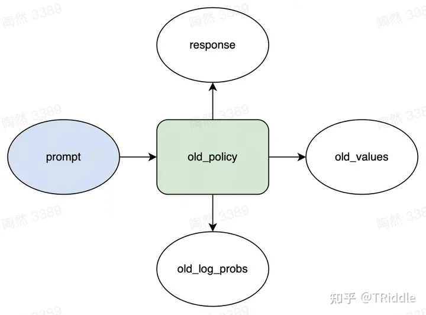
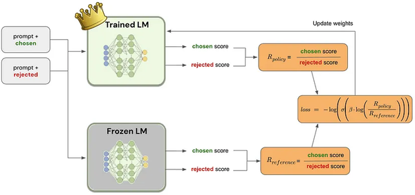

# 一、模型微调

## 1 P-tuning

### 1.1 prompt 技术简介

1、简要介绍

当我们要训练的模型很大的时候我们会发现，fine-tuning是很难提升模型的效果的，这是因为模型变大的同时，模型的参数也越大，而fine-tuning就是利用数据集去改变模型的weight,所以原模型参数越大、效果越好你需要通过fine-tune的数据就越多，所以，在大模型的训练中更多的使用是prompt的技术。

prompt的提示分为硬提示和软提示。目前主流的方法是软提示。promt是提示学习，而promt-tuning是就是利用软提示的方式来让机器写提示学习。所以promt-tuning可以理解为：

**在Prompt中插入一段task-specific的可以tune的prompt token。**即通过提示学习，让机器写提示语句，然后再生成固定的任务。目前关注点比较多的是如下三个：

- P-tuning：将prompt变成token，用BiLSTM进行学习。
- P-tuning：使用混合的prompt初始化策略（如CLInit和SelectInit）。
- Prefix-tuning：对于不同模型，将prompt注入输入的不同位置。原理图如下：

参考：https://zhuanlan.zhihu.com/p/524383554


### 1.2、论文简介

论文1：https://arxiv.org/pdf/2103.10385.pdf



p-tuuning是一种利用模板训练数据微调，解决gpt等模型对NLU（自然语言理解）效果不佳的过程。具体的过程可以简要的表示为.作者认为MLM（Mask Language Model）可以表示为模板。
$$
T={|P_{0:i},x,P_{i+1:m},y|}
$$
传统的prompt的方法是将T中的每个token隐射为embedding，将生成的通过预训练模型，生成一个完整的分数进行迭代训练。而p-tuning则是利用一个模型将pi迭代为一个可以训练的参数hi，利用hi一起进行迭代训练。

p-tuning的代码细节可以表示为：

- 输入一个句子，以及预先设计的一个离散的模板：`The Disney film is good! It was [MASK].`；

- 先使用BERT的分词工具分词，并获得input ids、position ids、attention masks等；
- 对输入的template中，挑选一个（或多个）token作为pseudo token：`The Disney film is good! [pseudo] was [MASK].`其初始化可以直接使用原本的token embedding；
- 对所有的pseudo token $p_i$ ，喂入一层LSTM，并获得每个pseudo token输出的隐状态向量$h_i$
- 将整个句子喂入BERT embedding layer，对于pseudo token部分的token embedding，则使用$h_i$  进行替换，最后喂入MLM中获得[MASK]位置的预测结果。

参考文献：

https://blog.csdn.net/qq_36426650/article/details/120802305

https://kexue.fm/archives/8295


**论文2：The Power of Scale for Parameter-Effificient Prompt Tuning**

这篇文章讲了一种大模型（T5）进行prompt-tuning的方法，这篇文章大致讲了调优的方法，和上面的论文类似，输入token序列X,Y为class的标记序列。同时为了训练将原始模型的$\theta$进行冻结，只对原模型的embedding层和prompt_token进行参数的迭代。所以模型就有个$p_{\theta}$这个表。


**论文3:Prefix-Tuning: Optimizing Continuous Prompts for Generation**

prefix-tuning为一种轻量级的提示学习方法。

主要思想为：

- **固定预训练模型的参数，只对小部分的参数进行微调。**
- 受到prompt的启发，提出了一种**prefix-tuning**的方法用于生成任务之中。


主要的思想是在输入的token中添加一个前缀向量（prefix）冻结整个预训练模型的同时，只对前缀向量进行迭代。即通过添加的前缀token和transformer的自注意力机制对整个模型进行迭代。

参考：https://blog.51cto.com/u_15919249/5962258


**论文4：P-Tuning v2: Prompt Tuning Can Be Comparable to Fine-tuning Universally Across Scales and Tasks** 

https://arxiv.org/pdf/2110.07602.pdf


之前的p-tuning有两个不足：

（1）可训练的参数太少

（2）embedding的改变对结果影响不直接。

p-tuning v2在p-tuning的基础上做了几个调整

（1）移除了提示的编码器（p-tuning的lstm prefix mlp<多层感知机>），改为了可选的重参数编码器

（2）在每一层 输入和模型层都添加了prefix layer

（3）引入了多任务学习，先在多任务的prompt预训练，然后再适配下游的任务。

（4）抛弃了prompt learning中的vertbalizer,回归到传统的CLS和token label分类范式。

论文还研究了不同prompt length的影响

（1）简单任务：情感分析，prompt长度（~20）就可以完成。

（2）复杂任务：阅读理解，需要更长的prompt（~100）。

参考：

https://zhuanlan.zhihu.com/p/618871247

https://zhuanlan.zhihu.com/p/422713214

https://www.zhihu.com/question/593448472

https://zhuanlan.zhihu.com/p/627642632

### 1.3 p-tuning的优缺点

1、优点：可以调试的参数少，迭代快。

（2）由于不是对模型本身进行的迭代，所以不会出现灾难性遗忘或者幻觉的问题。

缺点：（1）不能对模型本身进行知识的注入。

（2）提示模板的设计长度，编码模型的好坏对最终的微调效果影响很大。


## 2、lora微调

### 2.1、什么是矩阵的秩

​      矩阵的秩是线性代数中一个重要的概念，它反映了矩阵所包含的线性无关的列（或行）的最大数量。

​      在一个矩阵中，行和列可以线性组合。如果某些行（或列）是其他行（或列）的线性组合，则它们不会增加矩阵的维度。秩就是能够产生不同组合的线性无关行（或列）的最大数量。

秩的概念

https://zhuanlan.zhihu.com/p/498012558

​	可以说任何矩阵都能被多个有效的线性无关的向量表示。即一个矩阵中真正有效的参数量是很少的。对于大模型来说(LLM),更新其权重空间$\Delta w$拥有极小的秩，这也代表我们可以选用一个W=AB代表这些秩的低秩矩阵来代表这些增量的迭代过程。

### 2.2 什么是lora

​	lora微调很简单即在模型旁边增加一个旁路矩阵进行微调，做一个降维再升维的操作，来模拟所谓的模型微调。训练时固定模型的PLM参数，只对降维矩阵A和升维矩阵B进行迭代。

​	注意，lora是在transformer中的**旁层**新增的权重矩阵，这也代表lora推理和**训练**是并行的。


###   2.3 lora的优点：

优点1：lora是采用部分参数微调，并且使用的是额外的低秩的矩阵进行的，所以可以用来微调的参数量很少，所以使用lora进行微调矩阵迭代的速度很快。（由于lora是增加transformer的旁层，可以说lora微调和p-ting相比是微调中最快的）。

2、训练的矩阵小，由于是对模型进行全量冻结，只保存旁层的参数，所以进行模型迁移迭代时只要把lora的层保存就可以。

1、AB矩阵方便保存占用的空间小。

2、lora微调速度快，因为只有两个矩阵，相当于进行的多个矩阵相乘操作。

3、需要的显存小。

缺点：1、由于是低秩分解，所以秩最多只能近似的表示，无法完全等同于全量调参，对于一些复杂的自然语言的输入可能无法有效的理解。

2、lora更加适用于特定任务的微调，当数据量很多的时候，低秩存储的量是有限的，所以效果不佳。

3、lora微调后只对特定的任务的效果较好，但对通用任务的调参的效果较差。（因为加了旁参矩阵，这个矩阵主要是针对于特定任务，而对通用任务的效果较差）

### 2.4 Qlora

1、在加载时采用了4bit量化操作，减少了内存和显存的消耗，但是在推理时将其还原为FP16的精度进行。

2、QLORA在所有的全连接层都加入了低秩矩阵。

https://zhuanlan.zhihu.com/p/671089942

### 2.5 lora调参的超参数设置

```
learning_rate: AdamW 优化器的初始学习率。设置过大会出现loss值无法收敛或过拟合现象即过度适应训练集而丧失泛化能力，对非训练集中的数据失去原本的计算能力
r： LoRA低秩矩阵的维数。关于秩的选择。
lora_alpha： LoRA低秩矩阵的缩放系数，为一个常数超参，调整alpha与调整学习率类似。
lora_dropout：LoRA 层的丢弃（dropout）率，取值范围为[0, 1)。
target_modules：要替换为 LoRA 的模块名称列表或模块名称的正则表达式。
```

一般来说可以调节的就这几个参数，

秩：秩代表lora要用多大矩阵的秩来优化模型，比如r=256，就用256的秩优化，一般来说，秩越大模型微调能存储的信息也越多，但是迭代的速度就越慢。

lora_dropout：dropout的比例，防止过拟合。

lora_alpha：lora的缩放系数，类似于学习率，lora_alpha值越大，LoRA权重的影响就越大。越容易拟合微调的数据，同时之前知识的影响就越小。 一般设置 当lora_rank=256，lora_alpha=128

## 3、adapter tuning

​	适配器微调，transformer的encoder模块为输入、多头注意力机制、前向传播、FFN，adapter tuning则是FFN的后面添加一个adapter tuning层，同样，为了模拟大模型的这种先降维再升维的方法，加入了先降维->线性层->升维。

https://blog.csdn.net/2301_77818837/article/details/135355919

优点：1、和lora一样也是在transformer中添加层，所以可以迭代的参数很少，迭代的速度快，要求的显存小。

缺点：这个缺点很明显：1、这个添加层相比于lora来说是串行的，推理速度慢。

2、保存模型时需要保存整个的模型参数。lora只需要保存自己的模型参数。

3、同样训练的参数量决定了自己微调的上限大小，不能用过大的数据进行微调。


## 4、p-tuning、lora、adapter tuing有什么不同

4.1 相同点

​        都是通过冻结大模型的参数层，在其中引入额外的深度学习的网络层从而进行迭代。都只需要较小的算力和代价迭代优化相应的模型。

4.2 不同点

​	p-tuning的真实原理是对模型构建提示模块的参数量，所以提示模块构建的长度以及标准会对下游任务产生影响。 lora和adapter都是在LLM中添加对应的额外的神经层，但是lora是并行的，adapter是串行的，并且受限于

# 二、项目微调

项目1：利用chatglm进行微调，目前

github:https://github.com/THUDM/ChatGLM-6B/tree/main/ptuning

在这个项目上可以进行训练，但是只能进行单卡训练。

训练数据：广告生成的数据集

| 硬件                   | 模型参数                        | 训练时长 | 数据大小 |
| ---------------------- | ------------------------------- | -------- | -------- |
| rtx3090 一张卡 24G显存 | per_device_train_batch_size 16  | 24h      | 11w      |
| a100 40g               | per_device_train_batch_size 512 | 19分钟   | 11w      |
|                        |                                 |          |          |

训练结果：

- 项目只能使用单卡训练，训练3000个step用时24小时
- loss下降一般，loss由7下降至6.0

微调效果：

在原版的项目微调上会出现灾难性的遗忘。

项目2：

github:https://github.com/liucongg/ChatGLM-Finetuning

在这个项目可以采用deepspeed的方法进行多卡的p-tuning训练

| 硬件          | 模型参数                      | 显存占用 | 训练时长 | 数据大小 |
| ------------- | ----------------------------- | -------- | -------- | -------- |
| a100 40g 双卡 | per_device_train_batch_size 5 | 48*2     | 30分钟   |          |
|               |                               |          |          |          |
|               |                               |          |          |          |

1、你用的什么方法进行大模型的微调

采用lora进行相应的训练，lora的训练方式就是将模型的参数层冻结，只训练两个矩阵，降维矩阵A和生维矩阵B(模拟LLM的encoder和decoder操作)，模型只保留BA即可。

为什么使用lora,


# 三、gpt的相关知识

### 1、gpt和bert有什么不同

GPT（Generative Pre-trained Transformer）和BERT（Bidirectional Encoder Representations from Transformers）都是基于Transformer架构的自然语言处理（NLP）模型，但它们在一些关键方面有所不同。

1. **预训练目标**:
   - **GPT**: GPT使用无监督的预训练，其目标是通过自动回归生成下一个单词，从而理解语言的上下文和关系。
   - **BERT**: BERT使用自监督的预训练，其目标是通过遮蔽输入文本中的一些单词，让模型预测这些被遮蔽的单词，从而使模型理解上下文中的双向关系。
2. **模型方向**:
   - **GPT**: 单向模型，只能从左到右生成文本。
   - **BERT**: 双向模型，能够同时考虑左右两个方向的上下文。
3. **两个模型的侧重点不一样**:
   - **GPT**:更侧重于decoder过程，即更加注重于生成之类的任务。
   - **BERT**:bert对于encoder过程更加看重。
4. **注意力机制**:
   - **GPT**: 使用单向注意力机制（scaled dot-product attention），即进行某个词语的生成只与前面的词语进行self-attention的计算。
   - **BERT**: 使用双向注意力机制，双向注意力即计算token时会联系整个句子的上下文进行句子的self-attention计算。
5. **输入表示**:
   - **GPT**: 以单向方式处理输入文本。
   - **BERT**: 以双向方式处理输入文本，允许每个词在上下文中进行双向交互。

总体而言，GPT和BERT都是强大的自然语言处理模型，它们在预训练目标、模型方向和任务适应性等方面有所不同，适用于不同的应用场景。

### 2、gpt中的温度参数

GPT模型中的"温度"参数通常用于控制生成文本的多样性。温度参数的作用是调整模型在生成下一个单词时对概率分布的敏感程度。具体而言，温度参数越高，生成的文本越随机和多样化；温度参数越低，生成的文本越倾向于选择概率最高的单词，使生成更加确定和一致。

通常，温度参数的取值范围为(0, ∞)，其中：

- 温度接近0时，模型会选择概率最高的单词，生成的文本更加确定。
- 温度较高时，模型会更加均匀地考虑不同单词的概率，生成的文本更加随机。

在使用GPT模型时，可以通过调整温度参数来控制生成文本的风格。例如，在OpenAI的GPT-3中，一般可以将温度设置在0.1到0.8之间，根据需要进行微调。不同的应用场景和个人偏好可能需要不同的温度设置。

### 3、gpt基础知识的介绍


#### 1、gpt1

##### 1.1 核心

​     gpt1是在大量的无标记样本中去做transformer的decorder训练进行语言生成，得到优秀的特征生成模型。

##### 1.2 背景

（1）在大量的无标记样本进行训练。

##### 1.3 训练方法

GPT采用pretrain+Finetune的策略进行训练。

1、在大量**无标记**的语料上训练LM_A。

2、在LM_A的利用微调的方式，采用**有标记的语料B**来进行LM_A的有监督训练。

3、gpt是单向传播的模型。



gpt的结构是这样一个单向层，有一个masked的多头注意力，经过一个layer norm层,经过前向传播（全连接层），再过一个Layer Norm.


在进行有标签的训练时，通常会采用L1或者L2正则。


#### 2、gpt2

##### 2.1 核心

gpt2在gpt1的基础上做了一些改进。

主要为

1、从单领域学习变成了多任务学习。

2、pre-train + fine-tune 仍需要监督训练，GPT-2 **弃用 fine-tune 采用 zero-shot**。


gpt2主要有如下几个改进

（1）用了大量的训练数据（博览群书），仅仅用了pre-training.

（2）数据中增加了大量的高质量数据。

（3）使用了prompt微调代替了fine-tuning微调。

（4）增大了模型的规模

##### 2.2 训练策略

prompt 能够帮助预训练模型**“ 回忆 ” 起自己预训练学到的知识**，**实质是将下游任务和预训练任务的统一（近似）**。**采用 prompt 时，模型不利用样本做训练，即不对预训练模型的参数做任何更新。**


finetune是用模型去迁就下游任务，但是prompt是用下游任务去迁就模型。**GPT-2的策略如同 “完形填空”**

#### 3、GPT3

##### 3.1  简介

GPT-2 验证了在大规模高质量数据情况下，可以用 zero-shot learning 替换 fine-tuning，让模型在预训练时自己学习各种 prompt 对应的回答。

对于所有**下游任务**，GPT-3 **不利用样本做训练，即不做模型参数的任何更新。**

GPT-3 更进一步，加大模型参数和训练数据集，并且提出了一些新策略。

##### 3.1 核心

gpt3仍然采用自回归的方式训练模型，即增量的预测训练，比如 今天天气真->好。这样来进行相应的预测

gpt3的核心是：

（1）采用更大的模型参数，1750B级别的参数量。

（2）采用了高质量的训练数据，大概450T左右，其中用到了很多高质量的训练数据。

（3）gpt3仍然不采用微调，但是采用了情景学习的策略

**Zero-shot Learning (零样本学习)：** 在没有任何样本/示例情况下，让预训练语言模型完成特定任务。

**One shot Learning (单样本学习)：** 指在只有一个样本/示例的情况下，预训练语言模型完成特定任务。

**\*Few-shot Learning (少样本或小样本学习)：***指在只有少量样本/示例的情况下，预训练语言模型完成特定任务。

gpt3不对任何场景进行微调，但是在一些任务上会进行上述三种情景学习的提示，从而让gpt3来适应下游的各种任务。

比如 1+1=2，请问1+2= 让gpt3去生成。（单样本提示）


#### 4、gpt3.5补充

gpt3.5其实就是在gpt3的基础上加入了指令微调和思维链

1、指令微调

人工手写指令和语言模型引导的指令实例的集合。 这些指令数据由三个主要组成部分组成：**\*指令、输入和输出***，对于给定的指令，可以有多个输入和输出实例。



2、思维链

**CoT（思维链）**简言之就是**给模型推理步骤的prompt**，**\*让其学习人类的思考/推理方式***，从而让模型具备基本的推理能力，最终可以求解一些简单甚至相对复杂的数学推理能力。

以下是一个示例(左侧为标准 prompt，右侧为基于 Cot 的prompt，高亮部分为CoT)，模型在引入基于 Cot 技术的prompt的引导下，一步一步算出了正确答案：


layer norm介绍：https://zhuanlan.zhihu.com/p/469344809

gpt参考 https://zhuanlan.zhihu.com/p/626899354


# 四  大模型常见考点

### 1、什么是多头注意里机制。优化，手写多头注意力机制

多头注意力机制，详见之前的bert和transformer.

手写的结果在pycharm中。


# 五、大模型的数据

## 1、数据收集

### 1.1 大模型的微调数据包括哪些

​          对于大模型微调来说，我们仍然采用微调（问答数据的方式）在模型增量训练完成以后进行数据的再训练。

其中预训练模型需要是代码、逻辑推理等各种微调数据的集合才能完全发挥模型的潜能。

其中sft的数据配比如下：

```python
1、逻辑推理数据 400条
2、思维链数据 3000条
3、模型的自我认知数据 300条（知道自己是什么模型，具体是干什么的）
4、安全防护指令10000条。 （对模型的安全性，及输出的安全性进行防范的数据指令）
5、法律数据检索159条。
（根据已知信息：法律1 法律2 法律3  问法律3是什么：回答法律3）
6、法律问答数据（问题为法律数据，回答为法律答案 169条）
7、leetcode代码数据1500条（输入leetcode的，输出leetcode的答案）
8、长文本报告（输入一个主题， 输出关于这个主题的报告。回到是一定长度的文本） 1800条
9、多伦对话2000条。
10、后期加入的自我认知数据49条。
11、小学数学题及思维链数据（401条）
12、涉案、情感、文本分类等分类数据494条。
13、国家主权及安全问题（500条）
14、政治敏感问题（600条）
15、多轮对话（22w条）
sft的微调数据大概 1-14大概7w条，1-15，9w条，不够就乘以10=400w条。每条平均200个token。差不多9亿个token
```

### 1.2 真实的增量训练数据配比

```python
通用数据集，即增量用的数据集，比如
1 科学、自然、物理等常识性数据集。新闻、小说、书籍等多种通用书籍、数学题、比较好的教学书籍文本、歌词。（8700000） 
2 单轮对话数据集（35w条）
3 多轮对话（22w条）
4 代码数据集（13w条）
5 公共安全领域的数据（产品使用数据、案情的分析数据、一些ai模型的训练数据，如涉案、涉情感、关键词1w7000条）
6 产品类数据（3w条）
7 客服类数据（1.5w条）
8 司法类数据（各种发条、法规、地方法120w、判决类数据20w、各种预案数据2w）
7 各种讲话、文书数据（比如18大、领导人的重要讲话、学习强国等比较正式）80w条。

书籍类870w条，代码数据22w条，公共安全领域涉案、涉毒、涉各种安全的数据17w条，客服类数据15w条，产品类数据30w条，司法类数据120w（客户给的舆情类、类案类、法律类、判决文书类），领导人讲话数据（30w），类案类数据（30w）,应急预案类（30w）。总计870+264=1134w，差不多1.13亿条数据。

混合比例1:1，264w基本数据和264w专用数据，528w条数据，5.28亿个token。
```

训练的速度：

```
但是主要对比了lora和deepspeed 单机多卡的全量训练两种方式：
############lora####################

8卡 a800-lora 1k数据集（100w token）1个epoch 14b
32秒 3.125w/秒
8卡 a800-lora 1k数据集（100w token）1个epoch 32b
60秒 1.5w/秒
72b及以上就显存溢出了

按照9亿个token,基本需要90000/3/3600=8.3小时的微调

###########全量#####################
8卡 a800-z3 1k数据集（100w token）1个epoch 14b
6分钟 0.27wtoken/s
16卡 a800-z3 1k数据集（100w token） 1个epoch 14b batch=8
21分钟 0.08wtoken/s
24卡 a800-z3 1k数据集（100w token） 1个epoch 14b batch=8
11分钟 0.15wtoken/s

增加batch是有效果的。
对于14b的模型进行微调，52800w/0.15w/3600=97h=4天
3个epoch 差不多就是12天
为什么全量微调30天，因为中间有间断的问题，比如出现数据的重复。
```


## 2、大模型的sft数据应该怎么构建

​	你们是怎么构建大模型的sft的数据集的，你们数据集的清洗流程是怎么样的。    

首先sft数据的收集应该尽量的满足以下几种要求：分别是多样性、质量性和非重复性。

###       1、满足数据的多样性

（1）多分类模型数据分类

​       数据的多样性的话，我们是采用分类模型的方式来进行筛选的，比如我们希望我们的sft数据包括新闻、代码、逻辑推理、思维链、摘要、指令调用、涉案、法律案情、数学题目等等。通过训练一个多分类模型来进行数据的分类。最后的多分类模型大概有个33种类别。

​	训练的模型使用的是bert-base-chinese-large.

​	对概率较高的数据纳入我们需要的指令数据集，概率较低进行人工审核，不断优化我们的模型。这个当时是用bert做的。

（2）人工制造

​	借助已有的开源或者闭源的api，对类别较少的指令数据进行制造，并添加至项目所需要的sft数据中。

###     2、满足数据的非重复性

​	对于指令数据来说最重要的就是去重，去重我们一般采用2重去重法，

​        方法1：采用**最大公共子串**和**最长公共子序列**方式对数据进行去重，过滤大部分的数据。为了减少时间复杂度。可以采用切块索引的方式进行存储。（长句切分为短句，利用短句进行二次判别索引回归判断最终的重复值）

​	方法2：对于已经过滤的句子，可以采用文本向量化的方式进行去重（simbert、文本向量模型等等）。

发现重复值大于一定的阈值的进行聚类的去除。

### 3、数据的质量性

​	1、数据的质量性的话，对数据进行常规的数据检测，比如是否以常见的完结符号结尾。

​	2、训练RLHF模型，对sft数据进行偏好标注。选择质量较高的数据。


## 3、大模型的sft数据大概有多少条，你们是怎么构建的

​	我们寻找的sft数据大概有30w条，主要是根据别人论文中的比例进行参考进行构建的，比如总共构建30w条，自我认知的数据占到3%，安全防护的数据为5%,专用领域数据20%，那么按照提前准备好的数据量综合乘以比例来准备微调的数据量。

## 4、在训练大模型的过程中如何防止模型过拟合，你们的评测指标有哪些？

### 4.1 目前大模型生成的评测指标有哪些。

#### 1、BLEU（用于衡量生成答案与参考答案的相似度）

$$
BLEU=BP×exp(\sum_{n=1}^{N}{w_n×logp_n}) \\
bp=\left\{\begin{matrix}
1,lc>=lr \\
exp(1-lr/lc),lc<=lr
\end{matrix}\right. \\
lc=机器译文的长度
lr=最短参考翻译句子的长度
$$
BLEU 需要计算译文 1-gram，2-gram，...，N-gram 的精确率，一般 N 设置为 4 即可，公式中的 Pn 指 n-gram 的精确率。

Wn 指 n-gram 的权重，一般设为均匀权重，即对于任意 n 都有 Wn = 1/N。

BP 是惩罚因子，如果译文的长度小于最短的参考译文，则 BP 小于 1。

BLEU 的 1-gram 精确率表示译文忠于原文的程度，而其他 n-gram 表示翻译的流畅程度。


   p_n，n-gram的计算如下：

   假设 机器译文c和原文为s1如下：

   ```
   C: a cat is on the table
   S1: there is a cat on the table 
   ```

$$
p1=\frac{|a,cat,is,on,the,table|}{n}=1  \\
   p2=\frac{|(a,cat),(on the),(the table)|}{|(a,cat),(cat is),(is on),(on the),(the table)|}=\frac{3}{5}
$$


   n为机器译文的个数，分子为n数组在s1的中的个数

   依次类推计算3-gram,4-gram等等

   但是为了防止异常情况的出现，一般会对这个分数进行修正。例如

   ```
   C: there there there there there
   S1: there is a cat on the table 
   ```

   这个1-gram就是1，但是翻译的效果并不好。为此模型在计算分子时，一般会设定一个重复的最大值，比如there在s1出现了6次，我们最大值设置为2，则分子最多只出现2次。


   优点：

   bleu能够快速的评价生成的内容与原始内容的好坏。

   缺点：

   bleu并没有考虑到数据的时序关系，比如我爱你和你爱我在1-gram的评分是一样的。

   blue:参考https://www.jianshu.com/p/c0b4a6eba850

#### 2、ROUGE（评估摘要质量和召回率）

rouge同样也是采用n-gram的形式来评测模型的生成效果的。
$$
p=\frac{m}{n}
$$
m为参考译文与机器翻译共有的n-gram个数。分母是参考译文中的n-gram数量。

```
C: a cat is on the table
S1: there is a cat on the table 
```

$$
rouge-1=\frac{|a,cat,is,on,the,table|}{|there,is,a,cat,on,the,table|}=6/7 \\
rouge-2=\frac{|(a,cat),(on,the),(the,table)|}{|(there,is),(is,a),(a,cat),(cat,on),(on,the),(the,table)|}=1/2 \\
$$

除此以外还有通过最长公共子序列来计算相似度的等等。

链接：https://www.jianshu.com/p/0afb93fda403

1. METEOR（结合词匹配与语义匹配的评估指标）

   meteor也是一个基于匹配的评价指标，主要还是基于n-gram的概念进行评价，但是其中加入了chunk的概念。
   $$
   p=m/s \\
   R=m/n \\
   F_{mean}=\frac{(p*R)}{(1-\alpha)R+\alpha P} \\ 
   \alpha=0.1 \\
   pennalty=\gamma(\frac{chunks}{s_(chunks)})^{\theta} \\
   meteor=(1-penalty)*f_{mean}
   $$
   m代表n-gram共同拥有的词语的数量，s代表机器输出的词语格式，n代表参考翻译的词语个数。chunks代表其中 的分块的概念，机器翻译和参考译文连续的相同的句子被称之为块（chunks）,s_(chunks)机器输出的n-gram的个数。

   来看几个例子

   


   ```
   例1：
   p=6/6=1
   R=6/6=1
   pennalty=0.5*(6/6)=0.5
   f=1*1/(0.1*1+0.9*1)=1
   meteor=(1-0.5)*1=0.5
   例2：
   p=6/6=1
   R=6/6=1
   f=1
   pennalty=0.5*(1/6)=0.083
   meteor=(1-0.083)*1=0.917
   例3：
   p=6/6=1
   R=6/7=0.8571
   F=2*1/（1+0.8571）=0.9836
   penalty=0.5*(2/6)=0.0185
   meteor=(1-0.0185)*0.9836= 0.9654
   ```

   meteor:https://www.jianshu.com/p/faf57b1726c5

   https://zhuanlan.zhihu.com/p/659729027

#### 4、Perplexity（模型困惑度，反映模型对数据的预测能力）

其实主要就是使用模型对token的连续的预测的概率进行了一个统计量。
$$
perplex(w)=p(w1,w2,w3,w4...,wn)^{-1/N}
$$
模型的概率越高，模型越好，困惑度也越小。ppl越低，代表模型生成的效果越好。


参考：https://zhuanlan.zhihu.com/p/657098465

https://zhuanlan.zhihu.com/p/651410752

模型的常见评价指标：

https://zhuanlan.zhihu.com/p/689820816


### 4.2 你们在训练时是如何防止过拟合的，有什么特别的方法吗，你的学习率、warmup是怎么设置的

​	大模型训练时我们首先会关注loss的情况，一般当loss趋于平稳时模型就训练好了，其次我们会在训练途中采用专有的测试集对模型各个方面进行预测，其中主要采用的指标就是困惑度（perplex）和BLEU来看模型的生成的自回归的情况。 最后我们会保留每一个epoch以后保存一次模型，分别对模型的进行选择题的评分，（主要分为open和专有），open为模型通用能力的测试，而专有的测试集为我们自己做的选择基于下游任务的选择题题目集。

​	常用的大模型的参数调整：

```
learning_rate:学习率 5e-6
epochs:3
batch_size:32 根据显存进行调整
warmup ratio:0.03
lr_schedule_type:cosin
```

学习率就不说了

warm_up:这个叫做预热学习率，主要是在模型训练时希望模型能够更稳定的迭代设置的一个超参数。由于模型在一开始训练时学习率设置的过大很容易造成梯度的不稳定，但是中期希望模型能够快速迭代，需要模型的学习率设置的更大一点。在训练末期我们希望网络收敛到 local minima，此时 learning rate 也应该小一点。warm up 的一套流程正好迎合了这种需求。

训练初始，warm up 把学习率设置得很小，随着训练的进行，学习率逐渐上升，最终达到正常训练的学习率。这个阶段就是 warm up 的核心阶段。接着，随着训练的进行，我们希望逐渐减小学习率，（learning rate decay），训练完成时，learning rate 降为 0 。

warmup_start_lr = 1e-5 #模型开始的学习率
warmup_steps = 1000 # 模型warmup的step数
max_iter = 80000 #最大迭代
lr0 = 1e-4 #正式训练时的学习率
power = 0.9  #控制学习率较低的速度


warm_up:https://www.cnblogs.com/chentiao/p/16778453.html

# 六、大模型及其考点

## 一、位置编码的考点

## 6.1  旋转位置编码，大模型的长度外扩

### 1、位置编码

一般的位置编码有绝对的位置编码和相对的位置编码，bert就用的相对的位置编码，采用三角函数的形式进行相应的位置编码。

三角函数的位置编码的公式如下：

$$
PE_{pos,2i}=sin(pos/10000^{2i/d})\\PE_{pos,2i+1}=cos(pos/10000^{2i/d})
$$
​     其中pos表示位置，i表示维度在第几维，d表示维度的长度。

特点：

- 周期性： 三角函数位置编码是通过正弦和余弦函数来生成的，这使得编码具有周期性特征。这种周期性特征有助于模型捕捉序列数据中的周期性规律，比如文本中的句子结构或者时间序列中的周期性变化。

- **连续性：** 与传统的位置编码方法相比，三角函数位置编码在相邻位置之间是连续的。这种连续性使得模型更容易学习序列数据中的局部和全局模式，同时减少了对位置信息的不敏感性。

- **位置信息编码：** 三角函数位置编码不仅编码了位置的相对信息（由于三角函数是周期的，可能不同位置的编码离的很近），还编码了位置的绝对信息（不同位置的编码不一样）。这使得模型能够更好地理解

### 2、相对位置编码

绝对位置编码但在处理长序列时可能会存在问题，因为序列的长度超过了模型能够处理的位置编码的范围。

相对位置编码是一种基于**相对位置**的方法，其中每个位置被编码为一个偏移量，表示该位置与其他位置之间的相对距离。相对位置编码可以通过在输入嵌入中添加额外的信息来实现。

这种编码方式可以处理长序列，并且能够在不同的上下文中保持一定的一致性。

目前大模型的位置编码主流采用了相对位置编码主要为以下两种：

ALIBI和Rope

### 3、rope旋转位置编码

(1) Rope介绍

RoPE通过引入旋转矩阵来捕捉位置之间的旋转关系。具体而言，RoPE使用一个旋转矩阵，将每个位置的位置向量与**旋转矩阵**相乘，从而获得旋转后的位置向量。这样，模型可以根据旋转后的**位置向量**来识别和理解位置之间的旋转模式。RoPE的优势在于它能够捕捉到序列数据中位置之间的旋转关系，从而提供了更丰富的位置信息。

(2)  优点

优点1：更好地建模**相对位置**信息：传统的位置编码方式只考虑了绝对位置信息，即每个位置都有一个唯一的编码表示。然而，在某些任务中，相对位置信息对于理解序列的语义和结构非常重要。RoPE通过旋转操作，可以捕捉到相对位置信息，使得模型能够更好地建模序列中的局部关系。

优点2：更好的**泛化能力**：RoPE的旋转操作可以看作是对位置编码进行了一种数据增强操作，通过扩展位置编码的变化范围，可以提高模型的泛化能力。

优点3：**旋转编码 RoPE 可以与线性注意力机制兼容**，即不需要额外的计算或参数来实现相对位置编码。这样可以降低模型的计算复杂度和内存消耗。这一点是其他混合位置编码方式（如Transformer-XL、XLNet等）所不具备的，因为它们需要额外的计算或参数来实现相对位置编码。


旋转编码的具体步骤：

对token中的每个词嵌入向量，首先计算其对应的query和key向量，然后按照token的位置计算**旋转编码**的位置。

按照旋转编码的位置对token进行两两一组的应用旋转。最后计算query和key的内积得到self-attention的结果。


旋转编码是具有远程衰减性的，即相近的位置的字相似性较高，较远位置的词相似性较低，以此让模型区分字之间的位置信息。rope也是一样的，随着相对距离的增大，向量的内积不断减小的，说明当q和k距离较近时，两者有着更大的注意力权重，否则权重更小。


需要注意的点：

1、每一个token都会有一个旋转矩阵$R_m$。m是序列的长度。

2、d的设置一般为偶数

3、训练长度外推的参数，1、缩放系数，需要外推多少，k=2，外推2倍，k=4,外推4倍。第二个是旋转编码的位置.

4、如NTK-Aware Scaled RoPE、NTK-by-parts、Dynamic NTK等长度外推方法，本质上都是通过改变base，从而影响每个位置对应的旋转角度，进而影响模型的位置编码信息，最终达到长度外推的目的。
$$
\theta_i=10000^{-2i/d}
$$

​	这里需要对base的作用进行说明，base的不同会影响模型远程衰减的程度，base越大，模型远程衰减的就越弱，这也代表模型对远端的知识越容易吸收。增大**theta**，会**减轻attention score的远程衰减，较远位置的信息不至于受位置距离影响过多**。

​	如果attention score 受到相对距离影响很多，也就是由于Rope的存在使得注意力分数的[远程衰减](https://www.zhihu.com/search?q=%E8%BF%9C%E7%A8%8B%E8%A1%B0%E5%87%8F&search_source=Entity&hybrid_search_source=Entity&hybrid_search_extra=%7B%22sourceType%22%3A%22article%22%2C%22sourceId%22%3A%22692197097%22%7D)影响较大，可能就会导致正确答案的分数过低，找不到知识，模型表现不佳，因此越是要训练长[context模型](https://www.zhihu.com/search?q=context%E6%A8%A1%E5%9E%8B&search_source=Entity&hybrid_search_source=Entity&hybrid_search_extra=%7B%22sourceType%22%3A%22article%22%2C%22sourceId%22%3A%22692197097%22%7D)，**Rope的theta就越是要设置的越大越好**，即theta越大其外推性越强。（但是外推越强需要的训练文本的长度也越长，因为theta的增大会导致近序列的远程衰减变慢，模型更关注长序列，对短文本的理解就会很呆，就是我们相对位置10和10000我们的关注度是一样的，那么对于**短文本的生成**是不好的。）

​	结论：1、theta越大外推性越好。2、没有足够长的训练样本，不要将theta设置太大，会影响最后的电积和模型的关注结果，theta越大，模型对**短文本联系和理解能力**会下降。


https://zhuanlan.zhihu.com/p/688558609

参考：https://zhuanlan.zhihu.com/p/647109286

外推的base:https://zhuanlan.zhihu.com/p/667864459

旋转编码的base:https://zhuanlan.zhihu.com/p/692197097

旋转编码的笔记：

https://zhuanlan.zhihu.com/p/645263524


## 6.2 大模型常见的位置编码方法

由于transformer模型对位置时不明感的，所以当输入句子时，我们感知字的顺序基本有两种方法：

1、绝对位置编码

2、让attention进行点积时有能力分辨不同位置的token构成相对位置编码。

目前大模型的位置编码主要有以下几种：

### 1 、三角函数编码

三角函数编码是transformer的一种编码方式，主要是采用余弦与正弦函数，将位置信息进行向量嵌入。主要特点有：

1、有远程衰减性。距离越远词语内积的权重越小。

2、设位置为i,j，两者进行内积时的大小与位置的绝对位置有关。

3、有一定的对称性和周期性。

### 2、旋转位置编码

见上面

### 3、ABILI

为了有效地实现外推，作者引入了一种称为"注意力线性偏置 (ALiBi)"的方法。与传统方法不同，ALiBi不向单词embedding中添加位置embedding，而是根据token之间的距离给 attention score 加上一个预设好的偏置矩阵，比如 p和 k 相对位置差 1 就加上一个 -1 的偏置，两个 token 距离越远这个负数就越大，代表他们的相互贡献越低。由于注意力机制一般会有多个head，这里针对每一个head会乘上一个预设好的斜率项(Slope)。

ALiBi方法不需要对原始网络进行改动，允许在较短的输入序列上训练模型，同时在推理时能够有效地外推到较长的序列，从而实现了更高的效率和性能。

参考：https://zhuanlan.zhihu.com/p/650469278

### 4、其他位置编码

将位置编码通过缩放或者转换的方式，进行位置的映射。

（1）进制印射： 比如原位置编码为1024，将其改为16进制即可表示更长的数。

（2）位置线性插值：

线性地缩小位置索引，即将位置序号等比例缩小。如将 [0,4096] 对应位置缩放到原先支持的区间 [0,2048] 内。由于一般大模型的位置编码有时是通过数学计算得到的位置矩阵，所以只需要重新训练位置矩阵即可。


## 二、大模型与其他模型的常见概念

## 6.2 joint bert

## 6.3 bert和gpt之间有什么区别，能简要介绍下吗

1、相同点

​      gpt和bert都是基于transformers框架的模型，但是两者有明显的不同。

2、不同点

点1微调方式不同:**预训练任务**：

GPT使用了一种称为**自回归语言**建模（Autoregressive Language Modeling）的预训练任务。在这个任务中，模型被要求根据输入的前文预测下一个单词。BERT使用了一种称为**掩码语言建模**（Masked Language Modeling）的预训练任务。在这个任务中，模型被要求根据输入句子中一些单词被随机遮盖的情况来预测这些被遮盖的单词。

点2：**方向性**：

GPT是单向的，只使用了**前文**来预测下一个单词。 BERT是双向的，因为它使用了整个句子的上下文信息来预测每个单词。

点3：**应用领域不同**

由于gpt模型特性，gpt常用于生成任务，需要迁就下游任务时一般采用指令微调的方式进行。bert不一样，bert的应用领域为文本分类、命名实体识别、句子关系分析等等，并且这些任务一般采用微调的方式进行。

点4：**模型结构不同**

bert采用的多层的transformers，采用的encoder和decoder的结构。而gpt则只采用了decoder的结构。

gpt和bert的两者区别：

https://zhuanlan.zhihu.com/p/607605399

gpt的模型结构：

https://www.zhihu.com/question/594541240/answer/3379518716


## 6.4 gpt的模型结构

1、gpt是decoder的模型结构


gpt的模型结构很简单，可以分为两个部分，一个是多头的自注意力机制，一个是feed forward前向层。

2、gpt为什么要用decoder结构

1、相比于bert来说，gpt不仅采用了decoder的结构，而且采用了单向的decoder,这是因为：

（1）decoder相比于之前的encode-decode编码，整体的结构更加简单。

（2）gpt是自回归的任务，相比于encode-decode来说，decode更加适用于自回归的任务。

（3）gpt采用了更大的模型，所以decoder的话效率更高。


## 6.5 encoder-decoder,encoder only,decoder only哪个更好

https://zhuanlan.zhihu.com/p/642923989

1、现在常见的模型分为上面三种。

**编码器负责理解和提取输入文本中的相关信息**。这个过程通常涉及到处理文本的序列化形式，例如单词或字符，并且用**自注意力机制（Self-Attention）来理解文本中的上下文关系**。
**编码器的输出是输入文本的连续表示**，通常称为嵌入（Embedding）。这种嵌入包含了编码器从文本中提取的所有有用信息，并以一种可以被模型处理的格式（通常是高维向量）表示。
这个嵌入然后被传递给解码器。**解码器的任务是根据从编码器接收到的嵌入来生成翻译后的文本（目标语言）**。解码器也使用自注意力机制，以及编码器-解码器注意力机制，来生成翻译的文本。

三者都属于seqtoseq。

2、三种模型针对的任务

（1）encoder

单纯的encoder模型主要是做向量编码的，比如bge等向量编码模型。并且encoder更擅长于捕捉句子的信息，所以一般用于**向量编码、文本分类**等任务。

（2）encoder-decoder

encoder-decoder代表，先要用encoder去获取句子的全局向量信息，再通过decoder去对全局向量信息去进行解码。这种模型使用强烈依赖于**文本输入**的任务，比如**翻译，文本总结**等等

（3）decoder only

decoder only则更加适用于自回归任务，例如问答，文本续写等等。

常见的模型：


## 6.6 T5模型和gpt模型的区别

1、T5

​	什么是T5模型。T5是（transfor txt to txt transformers）的简写，主要的原理就是将所有的nlp任务转为text to text。通过这样的方式就能将 NLP 任务都转换成 Text-to-Text 形式，也就可以**用同样的模型，同样的损失函数，同样的训练过程，同样的解码过程来完成所有 NLP 任务**。其中T5使用的是encoder-decoder模型。

2 t5的训练过程

1、采用了**encoder-deocoder**结构

2、采用了和bert的一样的MLM的方式进行训练，其中mask采用了 replace span(小段替换)，将替换中的相邻的[M]都合成了一个特殊的字符，每一小段替换一个特殊符。


破坏细节：替换比例和bert一样15%，破坏的长度为3。

3、模型对text-to-text采用了prompt提示学习的方法，例如 将下面这段话翻译为英文（翻译任务），判断下面的这个句子是负面还是正面（文本分类任务），即**模型训练采用了prompt+MLM的选词填空的方式**。

参考：

https://zhuanlan.zhihu.com/p/88438851

## 6.7 texttosql模型训练

​        你的texttosql是怎么做的，分别用了哪些模型。

​	    这个项目其实就是一开始的texttosql模型，主要是使用bert进行训练的，主要的数据来源来自于两部分，一部分是从网上找的texttosql语句，然后是部门同事给了一批专门的texttosql数据。其实训练时分别用了bert,bert-wwm和T5三种模型进行测试，最后在T5的准确率是最高的。

​		但是从实用的角度来看，texttosql的准确率就很不稳定，差不多在测试的时候只有60%的代码能够跑通。这时我想的思路就是换个intent-slot模型来减缓其错误率，具体的操作是，intent确定指令，通过slot来确定关键词，然后通过指令加关键词的形式来进行最终结果的返回，最后采用的是joint-bert来完成的这个任务。

​	   

## 6.7 假如你有一批未标注的数据，但是标注人手不够，你有什么方法可以快速标注这一批数据。

1、可以采用attention+伪标签的形式进行模型的持续迭代，具体的步骤为：

（1）利用pytorch和tensorflow框架搭建一个类attention模型，标记少量的数据，训练一个小型的分类器。

（2）先选择一小批次的数据进行伪标签的并人工复核。将复核的数据中，按照attention的权重抽取相关的关键词。

（3）根据关键词选择对应词语的类别词典，如果文本的标签的概率值很大（比如大于0.7）,或者文本的标签的概率很小但是命中的关键词语很多k个以上（比如命中了3个以上）那么将其划分为对应的伪标签，一直迭代，直到选中的样本都达到一定的数据量。

（4）划分一个验证集，将按照2-3的步骤扩大训练样本，将扩大后的训练样本进行进一步的训练，在验证集进行测试，直到达到验证集的标准。


## 6.8  LLM出现复读机的问题应该怎么解决

（1）复读机问题是LLM模型在生成时，可能会根据用户的提问不断地重复某一个问题，或者生成的答案中会不断地重复某个字或者词语，结果在答案中会出现某个词语或者字不断重复的现象。

例如：

```
User: 你喜欢北京么？
AI: 北京是中国的首都，有很多名胜古迹，如长城，故宫，天坛等，我十分喜欢喜欢喜欢喜欢…..
User: 你喜欢北京么？
AI: 北京是中国的首都，有很多名胜古迹，如长城，故宫，天坛等，我十分热爱北京，我十分热爱北京，我十分热爱北京，…..
```


原因：

1、数据偏差：由于LLM训练是自回归模型，其中的训练预料大多数都是无监督的文本，所以当训练数据中含有重复数据或者重复数据较多就会出现复读机的现象。

2、自我重复效应：一般来说如果生成的答案出现重复，那么后续答案生成时就会受到自我强化的效应进行无限的句子循环，

3、句子多样性的问题：一般来说，训练数据的句子多样性越多，就越不容易造成数据的重复生成，其次要看训练的数据中的数据质量是否足够，如果有重复或者 语句重复的句子应该删除。


**解决方法**：

这个的解决方法主要有两个，一个基于数据的方法，一个是基于编码器的方法。

1、基于数据的方法:将数据设置的更加多样化一点，利用最大最长子串和最长子序列的方式剔除数据中的重复数据。

2、采用beam search（集束搜索）的方法来降低，因为gpt是每次选择所有句子预测概率最高的词或者字，这里将其改为 选择概率最高的num beam个输出。即选择k个字作为输出子集，在子集中选择概率最大的一个作为预测值。

3、设置温度T,T越大输出越偏离原本的答案，创造性越多，T越小，创造性越小。


## 6.9 市面上有哪些常见的开源大模型，可以介绍下吗，比如LLAMA chatglm 

1、目前市面上有的开源大模型主要有LLAMA和chatglm。

我们先看张图

| 模型升级               | 训练token  | 序列长度            | 模型参数             | 方法改进                               | 核心点                        |
| ---------------------- | ---------- | :------------------ | -------------------- | -------------------------------------- | ----------------------------- |
| ChatGLM->ChatGLM2      | 1T-1.4T    | 2k->8K/32K          | 7B->13B->70B(未发布) | FlashAttention & Multi Query Attention | Prefix-LM->Decoder-Only       |
| LLAMA->LLAMA2          | 1.4T->2T   | 2K->4K              |                      |                                        | 更高质量的SFT&RLHF            |
| baichuan->baichuan 13b | 1.2T->1.4T | 4K(RoPE)->4K(ALiBi) |                      |                                        |                               |
| baichuan->baichuan2    | 1.2T->2.6T | 4K                  |                      |                                        | Tokenizer/NormHead/Max-z Loss |


### 1、llama

llama是meta出的大模型，采用的模型架构还是decoder-only，其中llama模型中相比于其他的开源大模型主要有以下2个改进。

（1）模型仍然采用了多头注意力机制，但是采用了**RMSnorm的归一化**方式。

（2）在FFN层中采用了**SiLU**这样的激活函数。

（3）采用了 分组查询注意力（GQA）来代替原有的**注意力机制**。


llama仍然采用了全量调参的训练方式，其中采用了1.4T的训练数据，对于绝大部分的训练数据来说，都只训练了1个EPOCH.

llama介绍及训练数据。

总结：

**1、llama采用RMSnormer的归一化**

2、llama采用**siwrelu**的激活函数。

3、采用了Multi Query Attention减少了内存的使用。加快了模型的decoder速度。

（multi query attention）其实就是在多头的情况下，每个头共用同一个key和value的矩阵，而query则是采用共享参数的矩阵。


https://zhuanlan.zhihu.com/p/648774481

https://zhuanlan.zhihu.com/p/661347348

参考：multi-query-attention https://zhuanlan.zhihu.com/p/634236135

### 2、Chatglm


同样chatglm也采用了decorder only自回归方式，训练的框架由之前prefix-LM变为了Causal LM,严格的自回归模型。

1、decoder only的自回归方式

2、chatglm2时prefix-LM，而chatglm3则改为了causal LM的形式。

3、SFT过程所有的都通过gMASK在开头进行生成；即进行微调时，需要 一次性生成所有的答案。（完全的自回归的方式）

4、采用了Flash Attention（2k-32k）、Multi-Query Attention的推理加速，提高了模型的训练和推理的速度。


下面我们一个个来讲讲：

1、**decoder only**的结构就不说了，采用decoder only可以使得模型的生成效率更高，并且由于预训练时decoder也有语句理解的能力，所以在大模型加大量优质语料的加成下已经可以句子的理解能力了。

2、由**prefix-lm改为 causal lm**的原因：

（1）可以更好的构建训练数据，尤其是多伦对话，以前是

```
Q1->A1
Q1A1Q2->A2
Q1A1Q2A2Q3->A3

变为自回归以后：
Q1->A1
Q2->A2
Q3->A3

```

参考：https://zhuanlan.zhihu.com/p/651747035


## 6.10 你们微调大模型使用的哪种大模型，能介绍下吗

​	我们公司使用的是ziya-大模型，是由IDEA研究院做的模型。是一种基于中英双语预训练的语言模型。

### （1）Ziya有哪些优势和局限？

Ziya的优势在于它使用了大量的中英双语数据进行预训练，并在原生的LLaMa-13B模型基础上增量训练了110B tokens的数据。它还使用了监督微调、反馈自助、人类反馈强化学习等技术，使模型初具理解人类指令意图的能力。它还支持INT4量化，使得用户可以在消费级的显卡上进行本地部署。

Ziya的局限在于它的参数规模较小，不能处理复杂的逻辑问题；它的词表较小，不能覆盖所有的中英文字符；它的序列长度较短，不能生成很长的文本等。

### （2） Ziya有哪些应用场景和案例？	

Ziya可以应用于多种场景，如：

- 翻译：Ziya可以实现中英文互译，支持不同领域和风格的翻译，如文学、科技、口语等。
- 编程：Ziya可以根据用户的需求生成代码，支持不同语言和框架，如Python、Java、C++等。
- 文本分类：Ziya可以根据用户的标签对文本进行分类，支持不同主题和类型，如新闻、评论、情感等。
- 信息抽取：Ziya可以从文本中抽取出关键信息，支持不同格式和结构，如表格、列表、图表等。
- 摘要：Ziya可以对文本进行摘要，支持不同长度和粒度，如标题、摘要、概要等。
- 文案生成：Ziya可以根据用户的目的生成文案，支持不同场景和风格，如广告、营销、故事等。
- 常识问答：Ziya可以回答用户的常识性问题，支持不同领域和难度，如历史、地理、科学等。
- 数学计算：Ziya可以进行数学计算，支持不同运算和表达式，如加减乘除、分数、方程等。


## 6.10 Prefix-LM和Caual -LM的区别

prefix-LM是前缀语言模型，causual-lm是因果语言模型，

（1）Prefix-LM:前缀语言模型是一种生成模型，它在生成每个词时都可以考虑之前的上下文信息。在生成时，前缀语言模型会根据给定的前缀（即部分文本序列）预测下一个可能的词。

（2）Caual -LM:因果语言模型是一种自回归模型，它只能根据之前的文本生成后续的文本，而不能根据后续的文本生成之前的文本。在训练时，因果语言模型的目标是预测下一个词的概率，给定之前的所有词作为上下文。


两者的区别：

两者都是根据之前的上下文去生成后续的句子，但是不同的是，causal是逐步生成的，而prefix是一次生成的，是causal是逐步生成，上一个的输出是当前的输入。而prefix则用到了全部的上下文。

```
例如，Causal LM 可能会根据前文生成以下序列：

"我喜欢吃冰淇淋，明天会"
"我喜欢吃冰淇淋，明天天气"
"我喜欢吃冰淇淋，明天天气很"
"我喜欢吃冰淇淋，明天天气很晴"
"我喜欢吃冰淇淋，明天天气很晴朗。"
这里，Causal LM 在每个时间步生成一个词，直到生成完整的句子。

Prefix-LM 的生成方式：

给定前文："我喜欢吃冰淇淋，明天"
Prefix-LM 一次性接收整个前文，然后生成接下来的文本。
例如，Prefix-LM 可能直接生成以下完整句子：

"我喜欢吃冰淇淋，明天天气很晴朗。"
这里，Prefix-LM 在一次性接收到整个前文后，直接生成了整个句子
```

2、prefix中每个token是可以相互看见的，但是causal是严格的自回归。teken只能看见之前的内容。


## 6.12  大模型训练为什么会出现灾难性遗忘，怎么解决。

1、模型训练时可能数据量已经超过模型的存储容量了，这时迭代模型会模型比较重要的秩矩阵的权重。导致模型对之前的知识遗忘。

2、训练的epoch较多，模型对这部分知识过拟合了、

3、训练的知识和之前的知识差异过大，导致模型对就旧知识的学习内容遗忘了。


解决方法：

1、采用逐步增量+微调，微调是对模型自身潜力的激发，所以当微调的效果不佳时看能否采用增量训练增加模型的知识，再在此基础上进行微调。使得模型对知识逐步进行记忆。为了防止模型的灾难性遗忘，可以少部分，多步骤的方式进行微调。

2、在训练时注入通用语料的知识，新知识和旧知识的混合比例设置为1:5,1:1采用混合语料进行训练。

3、采用微调的方式p-tuning,lora等冻结模型的原始层，只对增量层进行微调。

4、采用dropout和L1、L2正则来防止模型的过拟合。


## 6.13 大模型中有哪几种归一化的方式，每种有什么特点

大模型中的normer包括batch normer、layer normer和RMS normer

batch normer和layer normer都是利用数据的均值和方差来进行数据的归一化操作。ab是缩放因子



batch normer:https://zhuanlan.zhihu.com/p/685413979

rms normer的公式如下：




## 三、大模型的分布式推理的方式，大模型的常见推理的加速方式

## 6.11 除了self-attention 以外还有哪些别的attention方法

下面将介绍四个主要的attention架构，分别是MHA(multi Head attention)、MQA(multi Query attention)、GQA(group Query attention)还有flash-attention

### 1、Muti Query Attention 

​	采用k和v共享矩阵，每个head为独立的矩阵的方式来节省显存和加速。即Multi query attention中注意力机制的每个头中都贡献K,V矩阵，

原因：

1、减小了模型的参数，所以模型推理的更快。

2、由于缩小了k和v的矩阵维度，KV cache。MQA的KV cache比较小，可以存进缓存（SRAM）。MHA的KV cache较大，不能全部放进缓存，存进显存（DRAM）读取比较耗时。（评论）

### 2、Grouped-Query Attention（GQA）

相比于MQA来说，GQA的主要变体在于对于多头注意力机制，相同的头之间共用一份key,value矩阵

，每个头保留一份特有的query矩阵，每个组共享一个Key和Value矩阵，GQA-G是指具有G组的grouped-query attention。

当G=1时，其实就是Multi query attention,当G=H时，其实就是MHA.

https://zhuanlan.zhihu.com/p/683422108

### 3、flash-attention

​      flash-attention其实并没有优化attention的时间复杂度的方面，而是从软件的层面去优化的时间复杂度。具体为SRAM（shared memory）在显存中占比很小（一般 20MB）,但是在数据传输的时候速度很快（192TB/s），但是HBM(high xx memory)在显存中容量很大，但是传输速度较小，一般需要（十几Tb/s），flash-attention的主要目的是尽可能的使用SRAM去处理，而不是HBM从而加速。

​	HBM的显存空间很大，计算attenion的操作是O（n2d）的复杂度，为了加速模型的交换，这里将进行attention的操作进一步的切分，比如Q将切分5份。加入以前是Q1=[100,100]切分为[20,20],直到SRAM能够存储为止，将attention的计算在SRAM完成，但是在HBM存储相应的Q、K、V矩阵。来达到加速的效果。

​	


cuda中硬件通信的方式：

https://zhuanlan.zhihu.com/p/123170285


gpu的硬件从大到小是device->SM->cuda core

软件从大到小是 Grid->thread block->thread

cuda_core可以执行 thread,wrap代表sm上cuda_core调用thread并行的数量，一般32个thread并行可以称为一个wrap.SM的cuda核会分为几个wrap.

## 6.12 大模型推理加速有哪些常用的方法

​	大模型推理加速的话一般有以下几种：

​	1、模型层面

​	可以采用量化的方式进行加速，比如int4、int8等减少模型的参数和前向传播网络层的精度从而加速推理。

​	2、算法层面

​	（1）可以采用上面所说的attention改进以后的框架，例如MQA和GQA等等。

​	（2）采用模型蒸馏的方式。将大模型的logit作为老师，找一个小模型做蒸馏处理。

​         （3）Speculative Decoding（投机采样）

​	即使用大模型和小模型双重模型的方式，小模型是大模型蒸馏而来的，两者的分布很相似，具体的步骤为，设置一个生成token数n，让小模型先进行token的生成，生成n个token后使用大小模型logit判断生成的准确率

使用大模型去进行分布纠错，设小模型的输出概率为p(x),大模型为q(x),如果p(x)/q(x)大于一个随机数说明需要拒绝小模型生成的token重新生成。

​	参考

https://zhuanlan.zhihu.com/p/651359908

https://zhuanlan.zhihu.com/p/683986024


3、硬件层面

​	主要是针对硬件进行加速，例如flash-attention,采用将矩阵运算的过程存入SRAM中来加速整个的过程。


​	

## 6.13 你训练模型用的什么分布式训练方法，介绍下deepspeed.

deepspeed是大模型的分布式训练工具，可以将模型训练时的数据、显存、正向和反向迭代放入到不同的显卡中尽显相应的迭代，支持数据并行、张量并行、管道并行等一系列的操作。并且deepspeed还支持Zero技术，将优化器、梯度和模型参数从gpu下沉到cpu。

为什么能够加速：

1、**zero**技术，能够支持更大的显存，因为用到了cpu。

2、采用**deepspeed sparse attention**的技术，采用了稀疏注意力核心，降低了自注意力机制的内存计算的开销。 

3、采用了zero3的模型量化技术，在模型进行**正向和反向**传播时分别采用了FP16或者FP8的梯度计算和更新。

可以使用的调参：

```
{
    "zero_optimization": {
        "stage": 2,
        "allgather_partitions": true,
        "allgather_bucket_size": 5e8,
        "overlap_comm": true,
        "reduce_scatter": true,
        "reduce_bucket_size": 5e8,
        "contiguous_gradients": true
    }
}
```


1、使用几块gpu，分别是哪几块。

2、allgather_bucket_size：deepspeed需要将数据迭代的张量分为较小的桶，这个是桶的大小，每个桶的大小就越大，通信操作可能会变得更快，但也需要更多的内存来储存中间结果。合适的桶的大小需要根据实际情况调整。

3、reduce_bucket_size：同上

4、stages_gather_16bit_weight_on_model_save：在保存模型时启用模型fp16权重合。默认值为false。可以采用fp16的精度来优化模型速度，看是否需要保存。

5、迭代器的参数

```
"optimizer": {
        "type": "Adam",
        "params": {
            "lr": "auto",
            "betas": [
                0.9,
                0.95
            ],
            "eps": "auto",
            "weight_decay": "auto"
            "torch_adam": true,
            "adam_w_mode": true
        }
    },
```


迭代器名称：选择 adam、adamw

lr:学习率

betas：adam的超参数

weight_decay：L2正则化系数，L2越大，越不容易让模型过拟合。

adam_w_mode:应用L2正则化。


**调度器Scheduler**

```
"scheduler": {
        "type": "WarmupDecayLR",
        "params": {
            "warmup_min_lr": 5e-6,
            "warmup_max_lr": "auto",
            "warmup_num_steps": "auto",
            "total_num_steps": "auto"
        }
    },
```

调度器为调整模型学习率的一个参数，设置了模型学习率的迭代次数。

https://zhuanlan.zhihu.com/p/688169451


**6.13 大模型的分布式推理的方法有哪些**

目前的LLM并行策略主要包括：

1、数据并行技术(DP)：在推理和训练时，将数据划分到不同的GPU进行训练，并在不同的GPU上实现正向和反向的梯度传播与迭代。

2、张量并行技术(MP):即将模型的层分到不同的gpu上进行训练与推理。这个方法和模型的结构有关，需要针对不同的LLM进行适配。

3、流水并行技术（PP）:在模型加载到对应的设备的基础上，将数据进行进一步的切分。


## 6.14 deepspeed为什么能在fp16或者fp8的时候进行推理

​	这是一种空间换时间的方法，deepspeed通过引入fp16精度将降低fp32带来的损耗，具体为：

1、模型训练前，将模型的关键参数paramter以fp32进行存储。

2、在forward开始之前，额外开辟一块存储空间，将fp32 parameter减半到fp16 parameter；

3、正常做forward和backward，在此之间产生的activation和gradients，都用fp16进行存储；

4、用fp16 gradients去更新fp32下的model states；

5、当模型收敛后，fp32的parameter就是最终的参数输出；

作者：LAM

链接：https://zhuanlan.zhihu.com/p/685472786

来源：知乎

## 6.15 deepspeed中的zero1、zero2、zero3、zero-offload分别代表什么，他们的区别是什么

​	zero的方法是将参数进行切分的处理，zero1是将优化器进行切片，zero2是在zero1的基础上将梯度进行切分和迭代，zero3是在zero2的基础上将模型的权重进行切片和分层运行。

​	通信，通信的意思是显卡之间互相借用参数、梯度、数据的过程，比如显卡1要进行梯度的更新，就需要将其他几张卡的显存借用过来进行梯度的计算来进行通信的操作。这个过程主要是通过pcie的接口进行通信的。目前pcie4相比于pcie3差不多有2GB/S的通信量。

​	zero-offload则是在将模型中梯度、显存和参数复制一份到内存中，在内存里进行相应的梯度计算。

​	**z1、z2、z3**代表三种微调的方式，其实就是数据和模型的分布式训练，而**zero-offload**是模型的加载方式，可以说利用显存+内存用小显卡微调大模型。（测试过用1张a800训练32b的模型）

参考：

https://zhuanlan.zhihu.com/p/513571706

https://blog.csdn.net/qq_50097745/article/details/133065359

显卡通信

https://zhuanlan.zhihu.com/p/623976061


## 三、normer归一化的考点

## 6.15 batch normer和 layer-normer的区别。说说为什么要用normer归一化

​	两者都是进行归一化的一种方式，归一化的作用：

1、可以消除数据的量纲的影响，神经网络在很多时候都是矩阵相乘的形式，如果数据分布过大，那么神经网络的迭代中可能**很难收敛**，很依赖于 参数的调整。但是通过归一化的方式，能使得训练更加稳定。

2、归一化可以加速模型的收敛速度。

3、提升网络泛化能力：由于将输入数据进行了初始化的处理，消除了数据的量纲，所以也在一定程度上加强了模型的泛化性。


区别：

1、两者都是归一化的操作，bn是用batch归一化，ln是用样本内部的特征归一化，当batch较小时，采用LN较好。

2、BN对数据输入的要求更高，如果数据的分布较大时，使用LN进行归一化更好。

https://blog.csdn.net/qq_41667743/article/details/130095908


## 6.16 常用的几种normer的方式

除了上述的LN和BN以外还有RMS和deep normer

RMS_normer:
$$
RMS(s)=\sqrt{\frac{1}{n}\sum_{1}^{n}{xi} }  \\
a_i=\frac{x_i}{RMS(s)} \lambda
$$
优点：

1、减少了均值和方差的计算，归一化速度更快

2、归一化更加平滑。


Deepnormer:

deepnormer其实是LN的改版，会在LN之前，以$\alpha$扩大残差连接。初始化时，下采样了模型的初始化矩阵。

优点：

Deep Norm 可以缓解爆炸式模型更新的问题，把模型更新限制在常数，使得模型训练过程更
稳定。


https://www.zhihu.com/search?type=content&q=deep%20normer

 6.17 normer的几种位置

normer的位置分为 post-normer和pre-normer


### 1、post_normer

post-normer是在计算完残差以后进行的归一化操作。公式表示为：
$$
x_{t+1}=Norm(x_t+F_t（{x_t}）)
$$
$F_t$可以代表多头注意力，也可以代表FFN。

### 2、pre_normer

pre_normer的意思是先进行归一化再进行残差连接
$$
x_{t+1}=x_t+Norm(F_t({x_t}))
$$

  一般来说，pre_normer更容易训练。post_normer的效果更好。


具体原因：

1、pre_normer更容易训练:post_normer是在残差连接后进行的归一化，导致了反向迭代时其梯度会随着网络层层数的增加指数型的衰减（其实进行normer的本来目的就是为了能够快速的反向传播），但是post以后反而使得更深的层迭代的更加满了。而pre_normer时的梯度随着层数的增加是梯度的衰减减弱，所以训练容易。

2、post_normer效果更好：post_normer由于保证了x+ft的方差恒定，这就代表了在主干网络，x和f的作用基本是一致的，模型拟合的更好。而pre_normer由于每一层都对Ft进行normer,所以再多次迭代以后Xt的为主要影响，对数据整体利用不如post。

https://www.zhihu.com/question/519668254

https://zhuanlan.zhihu.com/p/674704060


## 6.17 常用意图识别的方式

1、如何进行多轮意图识别

​	joint-bert可以进行单轮的意图识别，如果是多伦的对话我们怎么进行意图的识别。

1、采用队列的方式进行槽位的填充，利用LLM自动提示补全。

```
BOT: 请问你有什么问题？                action: ask_any_question
USER: 我想寄件到北京                    intent: send_package
BOT: 请问您寄件的地址是什么呢？           action: ask_send_address? or ask_receive_package
USER: 杭州                            intent: send_package? or intent: answer_send_address  
BOT: 跟您确认一下，您是要从杭州寄到北京是吗？action: confirm_address
USER: 是的，另外我还有一个包裹要催一下？    intent: affirm or require_faster
BOT: 好的，已为您下了寄件订单，会有人联系您。action: order_success  which action?
BOT: 请问下您想查那个包裹的信息？          action: ask_which_package  which action?
```

比如上面的例子的意图是寄件，但是寄件的关键词却是通过好几轮对话确定的，这是我们可以进行意图识别。

进行slot 填充，比如slot规定必须有关键词1 关键词2，我们需要在跟客户的聊天中填充这些关键词并进行指令的询问，当然也可以进行意图的修改。如果填充的关键词偏离太多的话。


model+slot 进行意图识别。输入的slot不断的变，可以不断的进行提示。

https://zhuanlan.zhihu.com/p/106849583


例子2:

https://github.com/answerlink/IntelliQ




1、用户输入意图，利用大模型的记忆性，对文本进行自我提示，看是否和用户的问题相关。

2、如果不相关代表是新的意图，进行意图的分类。提取槽位。

3、不断判断意图的关联性，进行槽位的扩充，直到槽位填充结束。

4、通过意图和槽位去调用相应的api.


这里的难点在于，如何进行意图的转换：

```
比如：
q1:上海的天气怎么样   天气咨询
q2:我想定一张机票。   订机票
```

可以看出两者是不同的意图，解决方法：

1、LLM判断关联性，相关的话进行拼接，对拼接后的句子进行判断。

2、对q1、q2、...qn，两两拼接，由于qn更可能是最后的意图，（q1,qn）(q2,qn) (q3,qn) ...

得到分类的候选集 c1...cn-1（缩小分类的范围），然后将q1...qn喂入大模型，让大模型在候选集中选择。


## 四、大模型的检索篇

## 6.17 RAG检索模型，衡量RAG检索模型的主要指标有哪些？

1、准确率

主要为topk的准确率，比如输入100条数据，分别在top1 top3 top5的三个维度下看是否命中了正确的答案。
$$
precision=\frac{命中的条数}{总条数}
$$
2、平均倒数排名（MRR）

​	我们在计算RAG检索时，排序模型性能的指标（模型都能找到看找到的rank值）。 输入query，输出query的相似性的句子，假如A,在top1找到了，B在top3找到了，C在top5找到了，那么这个RAG的检索准确率为
$$
MRR=\frac{1+1/3+1/5}{3}=0.51
$$
​	这个指标主要体现了RAG的检索效果。

3、Recall和F1，这个参考分类的指标

## 6.18  你对检索模型做了哪些优化，你在训练的时候你的负面数据是从哪来的。

​	    我对检索模型的做了三方面优化，1、采用正面样本挖掘的方式对原始向量模型进行了微调。2、采用实体对齐的方式进行了重点词语的实体对齐。3、采用boom-tf-idf算法（es）和向量检索双重检索的方式对检索方式进行了优化。

2、训练时的负面样本

​	    首先训练时的正面样本我采用了句子本身。负面样本采用模型加人工标注的方式获得了。

​	    方法1：采用多个向量模型进行encorder和批量的求出相似度较低的样本作为负面样本。样本1-采用bge求出来相似度较低，且别的模型求出来相似度也较低（2个模型验证其相似度小于0.5）。

​	   方法2：针对性的优化负样本：（1）实体相同，意图不同的。在相似样本中找。比如 求dc4501对华为手机的取证和dc4501对小米手机的取证可能相似度很高。（产品实体相同，相似度很高的相似数据复核）（2）意图相同，实体不同。dc4501怎么恢复qq数据、dc4501怎么取证qq数据。

​       样本2-属于在相似样本中找，主要的优化方式用户的使用来进行反馈。

​       即样本1让模型**拟合**我们的产品数据。样本2**优化**模型的检索精度。

## 6.18 大模型的损失函数

大模型的损失函数还是交叉熵。

交叉熵的解释

```
https://blog.csdn.net/bulling/article/details/135656199?ops_request_misc=%257B%2522request%255Fid%2522%253A%2522171379982616800197015868%2522%252C%2522scm%2522%253A%252220140713.130102334.pc%255Fall.%2522%257D&request_id=171379982616800197015868&biz_id=0&utm_medium=distribute.pc_search_result.none-task-blog-2~all~first_rank_ecpm_v1~rank_v31_ecpm-15-135656199-null-null.142^v100^control&utm_term=llm%E5%B8%B8%E8%A7%81%E6%8D%9F%E5%A4%B1%E5%87%BD%E6%95%B0&spm=1018.2226.3001.4187

常见损失函数

https://blog.csdn.net/weixin_45134475/article/details/123830609?utm_medium=distribute.pc_relevant.none-task-blog-2~default~baidujs_baidulandingword~default-4-123830609-blog-131350999.235^v43^pc_blog_bottom_relevance_base8&spm=1001.2101.3001.4242.3&utm_relevant_index=7


```


## 五 情感分析的项目

### 6.18 介绍下你的textcnn的模型

1.1 模型框架

​	 情感分析在本文中其实相当于一个二分类模型，所以分类的好坏也在于这个二分类模型的好与坏。其中分类模型的主题框架仍然采用Text-Cnn模型。模型的整体结果如下

(1)  输入层

input:输入的词向量 [batch_size,sentence_l]	

(2)  embadding 层

embadding:自动生成一个embadding矩阵，[vocab_size,embadding_size]

输出：[batch_size,sentence_l,embadding_size]

扩充了一个维度，为后续卷积做准备  [batch_size,sentence_l,embadding_size,1]

(3) 卷积层+池化层

##### 第一步，分别进行四次卷积 和 池化操作

- 卷积核1 [2,embadding_size,1,64] strides=[1,1,1,1]   池化层1 [1,sentence_l-2+1,1,1]

卷积后的output 1_1: [batch_size,sentence_l-2+1,1,64]   

过一个非线性函数：output1_2 : relu函数 +bias  [batch_size,sentence_l-2+1,1,64] 维度保持不变

池化后的output 1_3: [batch_size,1,1,64] 

- 卷积核2 [3, embadding_size,1,128] strides=[1,1,1,1]   池化层2 [1,sentence_l-3+1,1,1]

卷积后的output 2_1: [batch_size,sentence_l-3+1,1,64]

过一个非线性函数：output 2_2 : relu函数 +bias  [batch_size,sentence_l-2+1,1,64] 维度保持不变    

池化后的output 2_3: [batch_size,1,1,64] 

- 卷积核3 [5, embadding_size,1,128] strides=[1,1,1,1]   池化层3 [1,sentence_l-5+1,1,1]

卷积后的output 3_1: [batch_size,sentence_l-5+1,1,64]   

过一个非线性函数 :  output 3_2 :  relu  函数 +bias  [batch_size,sentence_l-5+1,1,64] 维度保持不变    

池化后的output 3_3: [batch_size,1,1,64] 

- 卷积核4 [7, embadding_size,1,128] strides=[1,1,1,1]   池化层4 [1,sentence_l-7+1,1,1]

卷积后的 output 4_1: [batch_size,sentence_l-2+1,1,64]   

过一个非线性函数：output 4_2 : relu 函数 +bias  [batch_size,sentence_l-7+1,1,64] 维度保持不变    

池化后的output4_3: [batch_size,1,1,64] 

##### 第二步，再将数据拉平

由于上面步骤得到CNN+池化的结果都为[batch_size,1,1,64]，所以这里将数据进行一个合并

- 拼接卷积+池化后的结果

out_put_5=[batch_size,4,1,64]

- 将数据拉平

out_put_6=[batch_size,64×4]

##### 第三步，attention层

attention 的具体操作这里不做赘述，这里用attention 的作用只是给一个合理的维度释放。

其中alpha的维度为 [batch_size,1]

out_put_7=alpha*out_put_6

out_put_7的维度为[batch_size,64×4]

##### 第四步，全连接层

w=[64×4,2]

b=0.1

out_put_8=w×out_put_7+b [batch_size,2]

### 6.19 你为什么选择textcnn模型，你对text-cnn做了哪些方面的优化

1、情感分类模型仍然以TextCNN为主。

​	其实在决定模型之前，我调研过不少分类模型，主要包括TextRNN、transformer、DPCNN、RNNattention、CNNattention等多个模型，最终在测试模型的最终效果和推理速度后我还是选择了TextCnn模型。

（1）选择的理由：

1 是textcnn模型相比于其他模型来说，有着推理速度快，且分类效果明显的结果。

2 是我在textcnn中加入了self-attention来代替原有的cnn中的池化操作进行降维，使得textcnn模型的分类效果更加明显。

3、其他的模型主语textRnn、transformers、DPCNN、RNNattention、CNNattention等模型精度相比于TextCNN并没有很大的提升（或者没有提升，原因可能是因为RNN等模型是串联的速度慢，无法选择，而transformers是以字向量输入的，当时搭建的transformers的层数比较简单，所以迭代的效果不佳,DPCNN仍然是CNN的改版，相比于池化而言，这个模型可能泛化性并不强，很容易过拟合所以效果不好）。


2、对TextCNN的优化

1、使用self-attention代替池化操作进行降维。增强在卷积以后对各个卷积向量的自我挖掘。

2、加入了L2正则，防止模型过拟合。

3、在喂入数据时，采用了数据均衡调整，使得模型在迭代寻找鞍点时可以更平稳的迭代，反正模型进入局部最优拟合状态。

### 6.20 什么是focal_loss

1、常规的交叉熵

​	 我们来看看常规的交叉熵的公式的
$$
Loss=-ylog(\hat{y})-(1-y)log(1-\hat{y}) = $$
f(i)=
\left\{\begin{matrix}
-log(\hat{y}),y=1 \\
-log(1-\hat{y}),当y=0
\end{matrix}\right.
$$
​	

​	这个很好理解，就是找到1和0对应的概率值，将其的损失相加就可以。

​	但这样会有弊端，比如在第二次迭代中我们其中一些易分样本可以不需要关注了（如阈值大于0.7），对于这些样本我们让其继续保持就好，没有必要继续迭代了。对于难分的样本我们需要继续迭代，达到更好的效果。

​	先看看硬间隔。
$$
Loss=
\left\{\begin{matrix}
-\theta({0.5-\hat{y}})log(\hat{y}),y=1 \\
-\theta({1-(0.5-\hat{y}}))log(1-\hat{y}),y=0 \\
\end{matrix}\right.
$$

$$
\theta(x)=\left\{\begin{matrix}
1,x>0 \\
1/2,x=0\\
0,x<0\\
\end{matrix}\right.
$$

​			其实上面的公式也可以简化成：
$$
Loss=\theta(0.5-\hat{y}_{label})log(\hat{y}_{label})
$$
​		即找到对应的标签，获取标签对应的预测值，当预测值大于0.5，则损失为0，等于0.5维持不变,小于0.5，给与1的权重。我们可以使用函数去细化这种方式，即预测的越准，给与的权重越小，预测的越不准给予的权重越大。

2、软间隔

​	这里的软间隔，我们采用sigmoid函数，当x=0.5时y为0.5，x>0.5时，y随着x不断增加，x<0.5,y随着x不断减小。

​	  
$$
\sigma(2)=0.7 \\
\sigma(-2)=0.3\\
\sigma(-x)=1-\sigma(x)
$$


​	最终的公式如下：
$$
Loss=
\left\{\begin{matrix}
-\sigma(k(0.5-\hat{y})log(\sigma(\hat{y})),y=1 \\
-\sigma(k(-(0.5-\hat{y})log(\sigma(\hat{-y})),当y=0
\end{matrix}\right.
$$
这个简化为
$$
Loss=-\sigma(k(0.5-\hat{y}_{label}))log(\sigma(\hat{y}_{label}))
$$
​		即利用logit进行自加权。

参考：https://spaces.ac.cn/archives/4733

focal_loss是为了解决类别不均衡问题的常用的交叉熵，一般的二元交叉熵为


对应的概率为


但是在实际的过程中，可能存在数据类别不均衡的问题。很容易分类的例子（pt>0.5）也会产生一种规模不小的损失。当把大量简单的例子加起来时，这些易分的物体的损失值会压倒难分物体的类别。

为此，提出了focal_loss,focal_loss即在不同的预测样本前进行加权处理，对于容易区分的样本给与的权重小一点，对于难分的样本给与的权重会更大一点，对于易分的样本，给与的权重会小一点。


这个公式表明，如果一个样本被错误分类，且分类概率很小，那么得到的权重就很小，相反，如果一个样本被正确分类，且分类的概率很大，那么得到的权重就很大。(即一个样本如果是0.9或者0.1这种很确定的值，那么（1-pt）给与损失的加权就很多，相反，越靠近0.5,样本越难分，其实权重越高。)


其中$\alpha$主要用来平衡正负样本的，对正样本 和 负样本哪个更重视。

https://zhuanlan.zhihu.com/p/373407748


### 6.21 说说你的模型蒸馏

​		模型蒸馏即是采用损失函数加权的方式，将teacher老师学到的知识给student模型，从而提高模型的泛化性。

​	其中蒸馏的损失主要包含两个，一个$L_{hard}$，一个是$L_{soft}$,hard就是student的损失函数，这个很好理解，因为teacher老师也可能会教错，需要有人去纠正他。soft是教师加学生的损失
$$
L= \alpha*L_{hard}+\beta*L_{soft}
$$
​	hard不讲了，student的交叉熵。具体来讲讲soft。
$$
L_{soft}=-\sum{p^{t}_{j}log(q^{t}_{j})}
$$
​	其中$p_{j}^{t}$是teacher在温度t下softmax输出在i类上的值，$q_j^{t}$是student输出在第i类上的值。这里为什么不用硬间隔（teacher老师的label），因为软标签会带有更多的信息。比如使用1，只能说明这个teacher老师预测是负面样本，使用soft老师告诉你，负面样本的概率值是多大，与正面样本有多少差异（多分类更加明显）

​	其中求解softmax是含有t的softmax。

​	原始softmax为
$$
q_i=\frac{exp(z_i)}{\sum_{j}exp{z_j}}
$$
​	加入t以后为
$$
q_i=\frac{exp({z_i/T})}{\sum_jexp(z_j/T)}
$$
​	T越大，不同标签的softmax越平滑，分布的熵越大，模型会更加关注其他的负样本，T越小，样本的熵越小。

以3分类举例子，T=1可能为[0.1,0.8,0.1].T=3可能为[0.3,0.4,0.3]T越高，熵越高，信息越不透明。

## 六 大模型训练篇

### 6.22 大模型生成幻觉有什么好的解决方法吗？

1、RAG检索

​	通过检索生成的方式，将提问相关的东西确定化然后进行合成检索。

2、提示学习

​	一般来说，模型出现幻觉是对未知的数据的不了解，才进行的编造。提示工程能很好的解决模型的幻觉问题。

​	（1）比如岳飞的妻子是谁，模型可能会说岳飞的妻子是张三。这个我们可以采用sft的方式对模型进行一个**拒答**的微调，并且在输入中加入提示词，提示词"如果你对问题中的答案不确定，请回答我不知道".sft除了让模型说答案以外还需要让模型说真话。

​	（2）采用思维链的方式，思维链能够让模型的思维更加清晰，并且能够让模型在输出时给出相应的依据，这样的话模型也是一种自我暗示和检查的过程，也能够减少幻觉的出现。

3、RLHF

​	采用强化学习的方式对模型进行反馈修正，使得模型的回答更忠于原始文本的回答。

4、调节温度

​	大模型的温度设置，一般温度越高，模型生成的多样性就越强，温度越低，模型生成的越保守。

https://zhuanlan.zhihu.com/p/667144750	

### 6.23 大模型中的RLHF模型

大模型中的奖励模型

RLHF是大模型的反馈模型，能够对大模型的生成进行评分。利用评分对LLM的模型进行反馈迭代。所以RLHF包括几个部分。

#### 1 RM模型

RM（reword-model）:奖励模型，奖励模型的主要作用是根据输入的prompt和question还有answer，对模型的评分进行一个打分。RM的模型有两点，1、比LLM模型要小。2、输出是一个分数。

具体如下：

1、找一个小的LLM模型，设大模型中间隐藏层的参数维度为(B,L,D)，B为batch size大小，L为句子长度，D为mebedding的维度，将模型的最后一个维度改为全连接层。按理说每个句子对应一个分值就行了，但是目前对于长度为L的句子，奖励模型输出了L个值。我们用L维度上的**最后一个位置的值**当作为本句话的奖励得分。

2、利用pairs-loss进行损失函数的计算。训练时，时一个question对应k个答案，通过人类标注对这些答案按照回答的好到坏进行打分。训练采用对pair的答案进行差值计算进行反向迭代。如果给pair里边好的句子打分高（c_truncated_reward），坏的句子（r_truncated_reward）打分低，loss就会小。本质上这个训练过程就是模型区分回答好坏的过程。

```
loss += -torch.log(torch.sigmoid(c_truncated_reward - r_truncated_reward)).mean()
```

​	**RM模型**主要用于打分，即输入一个prompt+question+answer得到一个分数。

#### 2 四个模型

​	除了上面所说的RM模型以外，gpt还涉及了如下的四个模型，分别是

共涉及actor model， ref_model，reward model和critic model这四个模型，但是模型更新的只有**actor_model**和**critic_model**.**actor_model,ref_model**,是我们**LLM大模型**的副本，一开始就训练好的。critic_model和reword_model是通过**第一部分偏好选择训练**出来的副本。

​	其中critic_model提供每一步的奖励，reword_model提供整个句子的奖励。ref_model是个约束模型（不迭代的，被冻结的LLM），用来约束actor_model的训练。

​	由于我们最后要优化两个模型，一个是actor_model，使用ref和actor的kl散度优化，另一个是获得的奖励，即reward和critic得到的内容。所以我们获得的奖励包含了kl散度和rewards.

计算kl散度

```
# 得到两个模型的输出
output = self.actor_model(seq, attention_mask=attention_mask)
output_ref = self.ref_model(seq, attention_mask=attention_mask)
logits = output.logits
logits_ref = output_ref.logits
...
return {
...
# 分别得到两个模型在真实单词上的预测概率
'logprobs': gather_log_probs(logits[:, :-1, :], seq[:, 1:]),
'ref_logprobs': gather_log_probs(logits_ref[:, :-1, :], seq[:,1:]),
...
}
...
# 计算kl散度，log_probs里边存的数字经过log变化了，因此减法就对应除法
kl_divergence_estimate = -self.kl_ctl * (log_probs - ref_log_probs)

```

​	kl散度的维度上加上rewards.

​	最后的整个模型分为四个：self.actor: sft模型，可训练，作为策略模型；self.ref: sft模型，不可训练，只做前向推断，用于约束self.actor生成结果的向量分布；self.critic：reward模型，可训练，价值模型，用于对生成的每个动作打分；self.reward：reward 模型，不可训练，用于计算整个序列的奖励值。

#### 3 训练过程

训练过程主要包括如下几个值：

（1） 奖励值reward：奖励值主要包括两个部分，每个序列时输出的奖励值和actor与ref共同得到的KL散度。

（2）价值value：价值不等于奖励值，价值包含了未来的时刻的奖励nextvalues.values是critic的输出值。

由（1）和（2）得到的值可以得到advantages和returns,前者用来更新actor，后者用来更新critic.

公式如下：

```


def get_advantages_and_returns(self, values, rewards, start):
    # values（B，L） critic model输出
    # rewards（B，L）reward 包含kl散度
    # start answer开始的位置
    # Adopted from 		   
    lastgaelam = 0
    advantages_reversed = []
    length = rewards.size()[-1]
    # 计算每个时刻（序列位置）的critic model预测误差
    for t in reversed(range(start, length)):
        nextvalues = values[:, t + 1] if t < length - 1 else 0.0
        # critic model预测的是t到到最后一个时刻的奖励和，所以变化量delta可以用如下公式表示
        delta = (rewards[:, t] + self.gamma * nextvalues) - values[:, t]
        # self.gamma=1，self.lam=0.95是衰减因子，表示之前计算的delta对现在影响越来越小
        lastgaelam = delta + self.gamma * self.lam * lastgaelam
        advantages_reversed.append(lastgaelam)
    advantages = torch.stack(advantages_reversed[::-1], dim=1)
    # 后续用来更新critic model用
    returns = advantages + values[:, start:]
    return advantages.detach(), returns
```

（3）actor的loss由两部分组成，一个**目标actor和当前actor**，函数中old_logprobs是由目标actor输出的，logprobs是由当前actor输出的，ppo算法中actor的loss是使用当前actor输出的概率和目标actor输出的概率的比值来约束的，转换成log后就是logprobs - old_logprobs。

（4）计算critic的loss，在这里一样有一个**目标critic和当前cirtic**的概念，用当前cirtic输出的value减去目标Q值（也就是上面计算得到的returns）再求平方，所以是使用了当前critic的Q值和目标critic的Q值的均方误差作为critic的loss。

```
def actor_loss_fn(self, logprobs, old_logprobs, advantages, mask):
    ## policy gradient loss
    #logprobs, old_logprobs都是经过log变化的单词概率，这里带着log做减法就相当于在做概率除法
    log_ratio = (logprobs - old_logprobs) * mask
    # 指数操作去掉log
    ratio = torch.exp(log_ratio)
    pg_loss1 = -advantages * ratio
    pg_loss2 = -advantages * torch.clamp(ratio, 1.0 - self.cliprange,
                                            1.0 + self.cliprange)
    pg_loss = torch.sum(torch.max(pg_loss1, pg_loss2) * mask) / mask.sum()
    return pg_loss
```

```
def critic_loss_fn(self, values, old_values, returns, mask):
    ## value loss
    # 用“老critic model”的输出约束“新critic model”不要步子太大，裁剪一下
    values_clipped = torch.clamp(
        values,
        old_values - self.cliprange_value,
        old_values + self.cliprange_value,
    )
    vf_loss1 = (values - returns)**2
    vf_loss2 = (values_clipped - returns)**2
    vf_loss = 0.5 * torch.sum(
        torch.max(vf_loss1, vf_loss2) * mask) / mask.sum()
    return vf_loss

```

这基本就是RLHF的过程，共涉及actor model， ref_model，reward model和critic model这四个模型，其实更新参数的模型只有**actor model和critic model**。

#### 4  PPO

​	ppo的过程其实很简单，具体来说就是actor模型和crtic模型进行采样和输出，ref和reward模型得到采样进行反馈对actor和critic进行修正和学习。

##### 4.1 采样-输出

​	首先这里有个策略的说法，即之前的模型的迭代方式，可以理解为一个学生要在高三考大学了，我们需要知道这个学生之前是怎么学习的。这个学习的过程其实就是模型输出的过程，其中主要分为两个模型，一个critic对模型进行打分，一个actor对模型进行输出。

​	

​	首先是采样的过程，old_policy从prompt的池子中抽出M个prompt，对每个prompt进行采样。我们会得到三个数据，response：M个字符串，每个字符串包含N个token，old_log_probs：演员输出的 𝑀×𝑁 的张量，包含了response中token的对数概率log(p(token|context))。old_values,评论家输出的M×N的张量，即每次的奖励值。

​	这里采用old的原因是actor模型其实是不断更新的，即通过迭代现在的actor和之前是不一样的。

伪代码：

```
# 采样
prompts = sample_prompt()
responses, old_log_probs, old_values = respond(policy_model, prompts)
```

##### 4.2 反馈-奖励

​       反馈是利用得到的prob和values值计算response打分的的过程。过程如下：

     

​    其实奖励的计算过程reward可以表示如下：

  

​	可以看出reward的计算过程是，如果ref_log_prob的概率越高，rewards越高，old_log_prob越低，rewards越高，代表生成的多样性。并且old_log_prob要小于ref_log_prob，代表你要守规矩。你要获得好的奖励，score足够高，你的生成足够好，2、你得守规矩。

​	伪代码如下：

```
# 采样
prompts = sample_prompt()
responses, old_log_probs, old_values = respond(policy_model, prompts)

# policy_model的副本，不更新参数
ref_policy_model = policy_model.copy()

# 反馈
scores = reward_model(prompts, responses)
ref_log_probs = analyze_responses(ref_policy_model, prompts, responses)
rewards = reward_func(reward_model, scores, old_log_probs, ref_log_probs)
```

##### 4.3 学习-优势

​	学习遵循之前的两个点，策略和反馈，1、我们的策略是否有效2、有效怎么反馈与学习。这里就有一个概念优势，优势这里是用收益来衡量的。举一个例子。假设一个高中生小明，他在高一时数学考试的平均分为100分，在此之后，大家对他的数学成绩的预期就是100分了。到了高二，他的数学平均分提升到了130分。在这个学期，小明的数学成绩显然是超出大家的预期的。**优势 = 实际收益 - 预期收益。**

表现是可用分数量化的，故表现超出预期的程度也是可以用分数差来量化的。我们可以认为，在高二阶段，小明超出预期的程度为30分（130 - 100）。根据优势的定义我们可以说，在高二阶段，小明相对于预期获得了30分的优势。

​	对于LLM来说实际收益是： 	 	
$$
return[i,j]=\sum_{k=j}^{N}reward[i,k] \\
a[i,j]=return[i,j]-old\_values[i,j]
$$
​	第i个句子的预期收益（实际收益）就是从j到k的reward和，实际要考虑贴现等步骤。实际收益其实就是当前的奖励值(critic给的).有了优势以后可以通过优势来更新我们的actor和critic了，主要采用actor_loss和critic_loss来进行。

​	**actor的损失**表示为：
$$
actorloss=-\frac{1}{N}\frac{1}{M}a[i,j]×\frac{p(token[i][j])}{p\_old(token[i][j])}
$$
​	p_token表示迭代中actor的生成当前字的概率，而p_old代表ref模型生成字的概率（这个模型不迭代可以当成常数），当优势大于0时代表我们的策略是有效的，这时我们的ptoken生成的概率越高，loss越小（越倾向于我们新的模型的生成）。p_old相当于一个约束值，当old很大时，你的优势很大损失也不会很大。当old很小的时候，你的优势才会显现。即当原模型很确定的时候，你的反馈是受限制，即训练时步子不要太大。看下前面的迭代策略

```text
for k in range(20000):
    # 采样（已更新）
    prompts = sample_prompt()
    responses, old_log_probs, old_values = respond(policy_model, prompts)

    # 反馈（已更新）
    scores = reward_model(prompts, responses)
    ref_log_probs = analyze_responses(ref_policy_model, prompts, responses)
    rewards = reward_func(reward_model, scores, old_log_probs, ref_log_probs)
    
    # 学习
    for epoch in range(4):
        policy_model = train(policy_model, prompts, responses, old_log_probs, old_values, rewards)
```

​		这代表迭代20000步，每一次我们都用更新我们的新的actor的模型（训练4个epoch）

​	critic的损失：采用mse衡量了预期收益与实际收益之间的差异值
$$
critic\_loss=\frac{1}{2MN}(values[i][j]-returns[i][j])
$$
​		然后通过这两个损失去迭代actor和critic模型。基本就是ppo的全部过程。ppo其实主要就是让模型更加遵循指令的过程。

```
https://blog.csdn.net/sinat_39620217/article/details/131776129?utm_medium=distribute.pc_relevant.none-task-blog-2~default~baidujs_baidulandingword~default-0-131776129-blog-134791546.235^v43^pc_blog_bottom_relevance_base8&spm=1001.2101.3001.4242.1&utm_relevant_index=3 

知乎RLHF:https://zhuanlan.zhihu.com/p/624589622
ppo知乎：https://zhuanlan.zhihu.com/p/645225982
https://zhuanlan.zhihu.com/p/677341520
ppo算法：https://www.cnblogs.com/jiangxinyang/p/17553815.html
RLHF算法：https://www.cnblogs.com/jiangxinyang/p/17374278.html
```

### 6.24 你知道RLHF吗，RLHF的数据你们怎么训练的。和sft的区别

​	RLHF主要需要人工标注偏好数据集，然后利用训练奖励模型，主要对模型进行打分。其中ppo的训练过程中主要是为了让模型进一步的遵循微调的指令。

​       1、sft的是监督学习，主要是对模型进行指令的微调，但是**sft**的效果很受sft数据的多样性和质量的影响。但是其优点就是**训练简单，并且生成的多样性较高**。

​       2、RLHF进行强化学习会在模型在某一指令中遵循变强，但同时也弱化了模型的泛化性。当然如果你的**sft的多样性很高的话**也是没有问题的。

​	区别1：RLHF的模型生成多样性降低，更偏向于你标记的奖励模型的中的句子。（一般用来做特定的指令遵循任务）

​	2、ppo的训练不稳定，且由于涉及多个模型，也会在训练难度上加大。

​	3、需要多进行一个奖励模型的标注。

### 6.25 你知道别的RLHF方法吗，比如DPO

​	dpo也是一种强化学习的训练方式。相比于ppo来说的好处是绕过了评分模型，最终的模型主要有两个，一个是actor_model,一个是ref模型，数据的话需要两份，一份是SFT的微调数据，另一份是人工标注的偏好数据。



​	使用原始的模型通过sft微调得到两个模型，Trained LM和Frozen LM,公式如下：
$$
\beta log(\frac{π\theta(y_w|x)}{πref(y_w|x)})-\beta log(\frac{π\theta(y_l|x)}{πref(y_l|x)}) \\
=\beta ({π_{\theta}(y_w|x)}-{π_{\theta}(y_w|x)})-({π_{ref}(y_w|x)}-{π_{ref}(y_w|x)})
$$


​	其中$\theta$代表经过微调以后的LLM，而ref代表冻结以后的LLM，其中dpo的前半段代表代表希望我们训练的actor模型能够更加倾向于人类偏好，即我们标注的数据，而后面的ref模型代表我们使用原始的frozen模型进行一个约束，使得sft微调的时候模型不会偏离原先的效果太多。

​	可以看下dpo的损失函数，其实主要是4个logit，**policy_chosen_logps**， 训练模型对于chosen经过log后logits。**policy_rejected_logps**, 训练模型对于rejected经过log后logits ,**reference_chosen_logps**. 训练模型对于chosen经过log后logits ,**reference_rejected_logps**, 训练模型对于rejected经过log后logits.

代码如下：

```
def preference_loss(policy_chosen_logps: torch.FloatTensor,
                    policy_rejected_logps: torch.FloatTensor,
                    reference_chosen_logps: torch.FloatTensor,
                    reference_rejected_logps: torch.FloatTensor,
                    beta: float,
                    label_smoothing: float = 0.0,
                    ipo: bool = False,
                    reference_free: bool = False) -> Tuple[torch.FloatTensor, torch.FloatTensor, torch.FloatTensor]:
    # policy_chosen_logps: 训练模型对于chosen经过log后logits
	# policy_rejected_logps: 训练模型对于rejected经过log后logits
	# reference_chosen_logps: 训练模型对于chosen经过log后logits
	# reference_rejected_logps: 训练模型对于rejected经过log后logits
	# beta: policy和reference的差异性控制参数
	
	# actor模型选择chosen优先于rejected
    pi_logratios = policy_chosen_logps - policy_rejected_logps
	# reference模型选择chosen优先于rejected
    ref_logratios = reference_chosen_logps - reference_rejected_logps

    if reference_free:
        ref_logratios = 0
	
	# 差值可类似于KL散度，保障actor模型的分布与reference模型的分布不会有较大的差异
    logits = pi_logratios - ref_logratios  # also known as h_{\pi_\theta}^{y_w,y_l}

    if ipo:
        losses = (logits - 1/(2 * beta)) ** 2  # Eq. 17 of https://arxiv.org/pdf/2310.12036v2.pdf
    else:
        # Eq. 3 https://ericmitchell.ai/cdpo.pdf; label_smoothing=0 gives original DPO (Eq. 7 of https://arxiv.org/pdf/2305.18290.pdf)
		# label_smoothing为0，对应的DPO论文的算法
        losses = -F.logsigmoid(beta * logits) * (1 - label_smoothing) - F.logsigmoid(-beta * logits) * label_smoothing
	
	# chosen和rejected的奖励
    chosen_rewards = beta * (policy_chosen_logps - reference_chosen_logps).detach()
    rejected_rewards = beta * (policy_rejected_logps - reference_rejected_logps).detach()

    return losses, chosen_rewards, rejected_rewards
```

参考：https://zhuanlan.zhihu.com/p/680734930

几个超参数，一个是beta,控制choose和reject之间的一个程度，beta越大，模型训练会更偏向于choose，但是生成的多样性也越强。越小，多样性越高，对choose的偏移越小。

