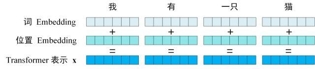
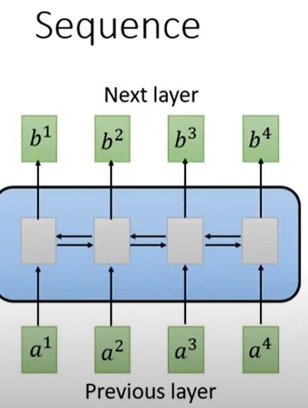
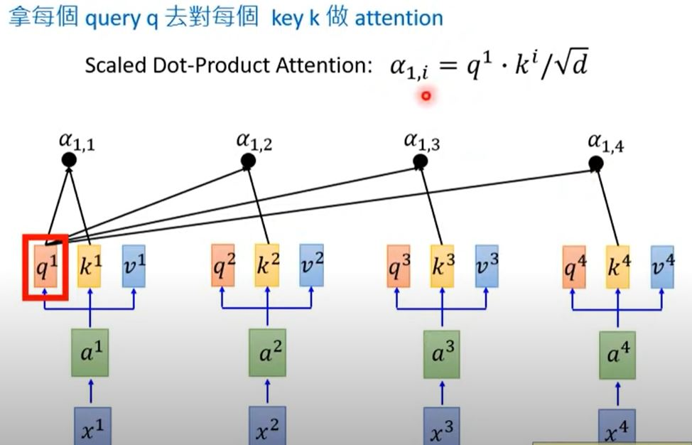
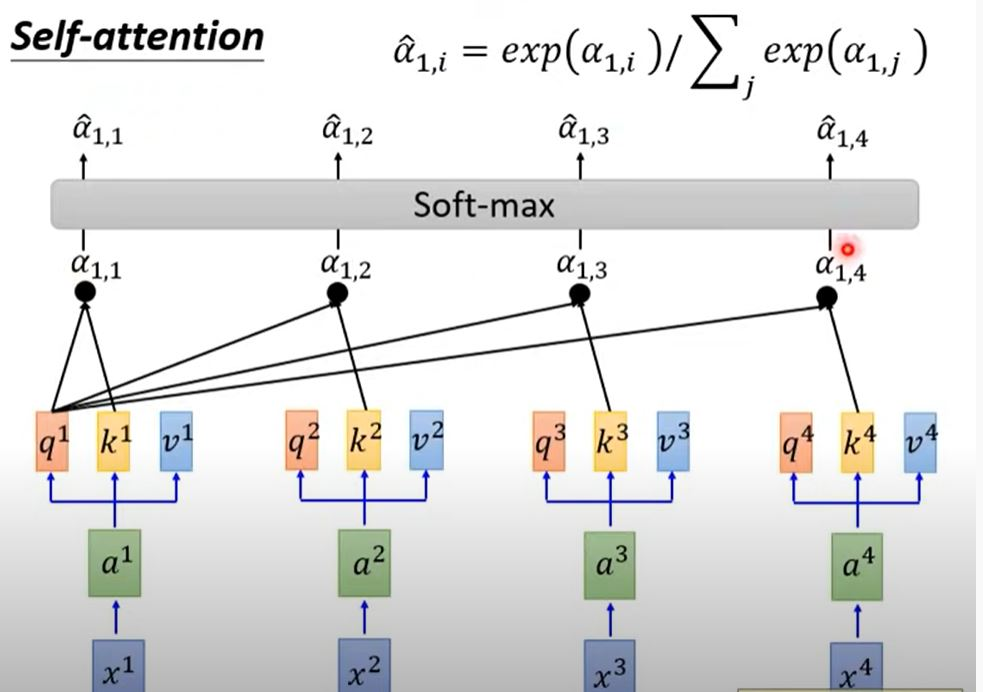
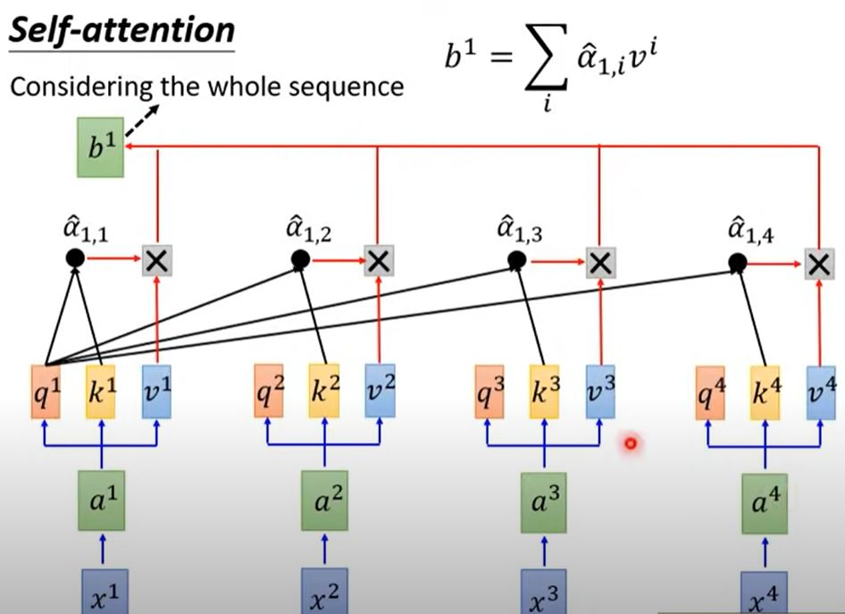
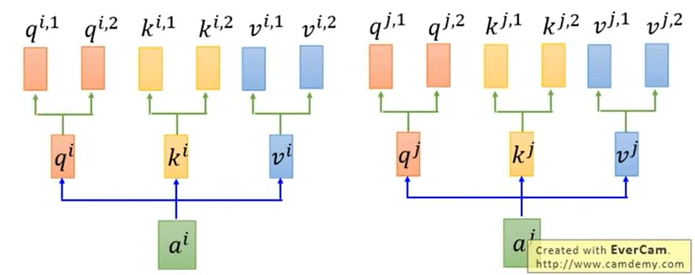
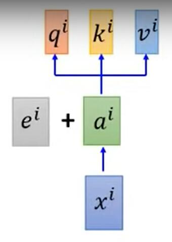
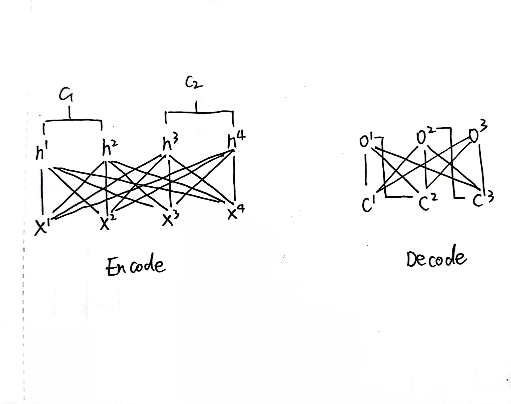
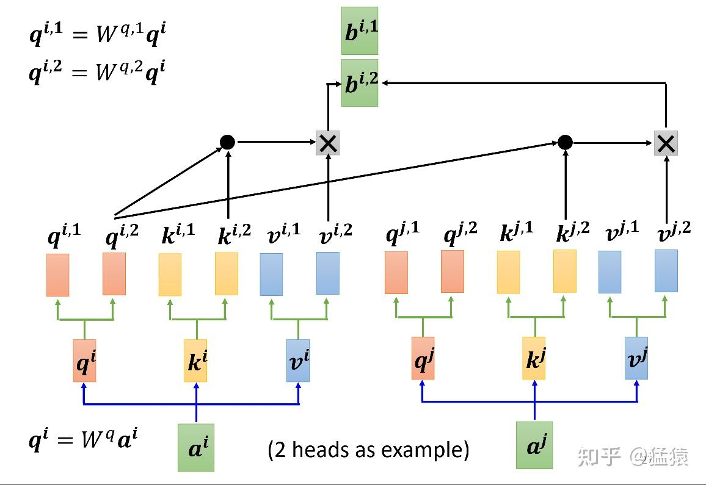
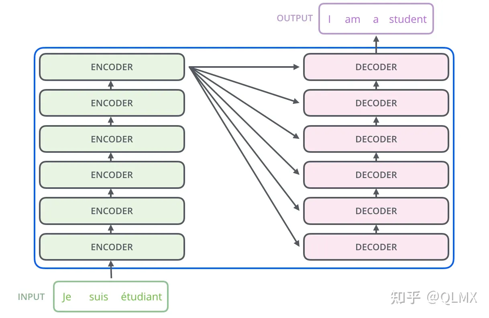

# transformer和Bert

# Transformer

## 一、self-attention

self-attention又称之为自注意力机制，是一种向量自己给自己进行权重计算的操作。

我们先看下tramsormer的框架图


可以看出transformer中使用了第一个是多头注意力机制的，第一个是使用了masked的多头注意力机制。

### 1、transformer的输入

#### (1) transformer输入简介

​		Transformer 中单词的输入表示 **x**由**单词 Embedding** 和**位置 Embedding** （Positional Encoding）相加得到。

​		

#### (2) 词embedding

​	   词语embedding即常规的embedding操作。

#### (3) postional embedding

​	又称之为positonal encoding操作。因为transformer采用并行的运行的方式，即前一个结果还没出来，便能预测下一个结果，但是这样的话便损失了句子的顺序性，为了弥补这个问题，transformer采用了一个positional Encoding的向量在模型并行化的同时提供句子的序列信息。

（3.1） encoding的原理及介绍

方式1：简单encoding

​	简单的encoding即使用词语或者字的序号去encoding。即

| token | encoding |
| ----- | -------- |
| 北    | 0        |
| 京    | 1        |
| 欢    | 2        |

这种编码方式的最明显缺点是：
对于特长序列，编码长度会不可控。

方式2：
$$
PE_i=\frac{i}{len}
$$

| token | encoding |
| ----- | -------- |
| 北    | 0.000    |
| 京    | 0.125    |
| 欢    | 0.250    |

​	这样的好处是编码的结果被限制到了0-1.但是也带来了一个新的问题，编码结果的尺度随着不同序列长度的变化也在变化，如10个单词和100个单词经过编码后，相邻单词的位置编码差距不在同一个数量级，并且仍然会随着词语序列的上升而上升。

​	 因此，一种好的位置编码需要达到以下两点：

​	1、位置编码的长度不随着序列的长度而变化，而是限制在一定范围内的。

​	2、序列变化的长度不会随着序列的序号而递增或者递减。

方式3：

​	**positional encoding**
$$
PE_{pos,2i}=sin(pos/10000^{2i/d})\\
PE_{pos,2i+1}=cos(pos/10000^{2i/d})
$$
​	其中的i为embedded的维度序号，pos为字或者词语的序号。d为向量的维度。i为词向量的维度

​	进行postion_encoding以后的维度和embedding以后的维度一样，但是却在其中嵌入了位置的信息

可以看个具体的例子：

例1：

**(1)词嵌入矩阵：**

假设我们有以下词嵌入矩阵，其中每行表示一个词的词嵌入：
$$
\begin{bmatrix}
0.1 & 0.2 & 0.3 \\
0.4 & 0.5 & 0.6 \\
0.7 & 0.8 & 0.9 \\
1.0 & 1.1 & 1.2 \\
\end{bmatrix}
$$
**位置编码：**

现在，我们将为每个词的词嵌入添加位置编码。假设我们使用一个3维的位置编码，因此d=3。

对于位置 d=0,pos=0，i=0,1,2，我们计算：
$$
\text{PE}_{(0, 0)} = \sin\left(\frac{0}{10000^{0/3}}\right)=0\\

\text{PE}_{(pos,1)} = \cos\left(\frac{0}{10000^{2/3}}\right)=1\\
\text{PE}_{(pos,2)} = \sin\left(\frac{0}{10000^{3/3}}\right)=0
$$
类似地，计算 pos=1,2,3 的位置编码。

**添加位置编码：**

将位置编码矩阵与词嵌入矩阵相加，得到新的矩阵：
$$
\begin{bmatrix}
0 & 1 & 0 \\
0.841 & 0.54 & -0.841 \\
0.909 & -0.416 & -0.909 \\
0.141 & -0.99 & -0.141 \\
\end{bmatrix}+
\begin{bmatrix}
0.1 & 0.2 & 0.3 \\
0.4 & 0.5 & 0.6 \\
0.7 & 0.8 & 0.9 \\
1.0 & 1.1 & 1.2 \\
\end{bmatrix}
$$
得到新的矩阵

## 二、multi-head attention 多头注意力机制

### 1 为什么要进行attention操作（self-attention的基本公式）

​        在attention之前最常用的是RNN等seq-to-seq模型，这种模型有个不好的地方在于，是串联的，即后一个输出的前提是前一个神经元已经给出了结果。为了克服这种传导的不确定性，有人提出了attention的操作，即并联的给出所有向量的权重向量，并计算最后的值。




attention会计算三个值：


$$
q^i=w^q×a^i\\
k^i=w^k×a^i\\
v^i=w^v×a^i
$$



通过注意力机制得到权重$a_{ij}$，并对$a_{i,j}$进行softmax处理得到$\hat{a_{ij}}$



通过对$a_{i,j}$和向量进行加权求和得到$b^{i}$向量

可以看出这种向量映射方式是并行的，即最后一个b4的生成和b1-b3是同时生成的。






多头注意力机制即指生成的qi,ki,vi有多个向量可以进行权重矩阵的计算。

此时的公式为：
$$
b^{i1}=q^{i1}*k^{i1} \\
b^{i2}=q^{i2}*k^{i2} \\
b^{j1}=q^{j1}*k^{j1} \\
b^{j2}=q^{j2}*k^{j2} \\
$$
继续进行多头的迭代
$$
b1=b^{i1}*v^{i1}+b^{j1}*v^{j1}
$$


依次类推，然后每个头的结果进行合并就可以了。

由于transformer进行迭代时，所有向量以权重矩阵的方式连接所以无法考虑词语的位置信息，为了解决这一问题，文章中指出可以将index以ei的形式加入矩阵。




其中ei代表词语的位置embedding。

### 2 encode和decode部分

这个和seqtoseq类似，都是以自注意力机制的方式相连接。Encode和Decode方式如下图所示:



### 3  多头注意力机制和 多头mask (masked multi-attention)

（1）mask 机制

从transformer的过程中可以看出，后期的decode部分也用的是self-attention的操作，但是为了防止模型作弊，在预测当前token时不能用后续序列的标签进行预测，这时就使用了masked-multi-attention.有时候，我们并不想在做attention的时候，让一个token看到整个序列，我们只想让它看见它左边的序列，而要把右边的序列遮蔽（Mask）起来。一般是在<span style="color: red;">decode时</span>使用这一操作。例如在transformer的decoder层中，我们就用到了masked attention，这样的操作可以理解为模型为了防止decoder在解码encoder层输出时“作弊”，提前看到了剩下的答案，因此需要强迫模型根据输入序列左边的结果进行attention。 

Masked的实现机制其实很简单，如图：


举例来说明MASK矩阵的含义，每一行表示对应位置的token。例如在第一行第一个位置是0，其余位置是1，这表示第一个token在attention时，只看到它自己，它右边的tokens是看不到的。以此类推。注意这里的+不是将矩阵加起来，而是表示掩码的意思，即为1的地方为掩码，此时将矩阵对应的向量调整至特别小的值，为0的地方填充原始值，这样decode时防止模型看到后面的答案从而作弊。

（2）多头注意力

先看一个图 ,图中很好的演示了什么是多头注意力机制。采用多头的机制就和cnn中的卷积一样，是为了从不同视角去衡量一个词向量或者字向量的表现形态。采用多头可以说就是从不同的视角去感受词或者字的向量空间。

​	


同样多头mask和单头mask是一样的，都是对当前index后面的index位置进行掩码操作。

多头注意力机制，有几个**头**，就会有几个向量进行输出。


transformer的表示链接：<https://www.zhihu.com/question/341222779/answer/2304884017>

## 三、transformer的层级结构

### 1、add和norm的表示

add+norm表示transformer的残差连接和

具体公式为
$$
LayerNorm(X + Sublayer(X))
$$
sublayer为子层的输出。X为输入

```
Input
   |
   v
 [Convolution]
   |
   v
 [Addition]
   |
   v
 [Normalization]
   |
   v
 [Activation]
   |
   v
 [Convolution]
   |
   v
 [Normalization]
   |
   v
 [Addition]
   |
   v
 [Activation]
   |
   v
 Output
```

大致过程如上

这里的关键点是 "Addition" 和 "Normalization" 步骤。在每个残差块中，输入通过卷积层进行变换，然后通过 "Addition" 将原始输入（跳跃连接）与卷积变换后的输出相加。接着进行 "Normalization"，然后再通过激活函数。整个过程使得网络可以更容易地学习残差，避免梯度消失的问题。

具体的数学表示可能是：

令输入为 x，卷积操作为 F(x)，残差块的输出为 H(x)。那么残差块的计算过程可以表示为：
$$
H(x)=Activate(Norm(Add(x,F(x))))
$$
这里，AddAdd 是加法操作，NormNorm 是归一化操作，ActivationActivation 是激活函数。在实践中，具体的归一化操作,例如批**归一化**（Batch Normalization）或**层归一化**（Layer Normalization）。这有助于稳定训练过程，提高模型的泛化能力，以及加速收敛。

Transformer 中的层归一化被应用在每个子层的输出上，其中包括自注意力层（Self-Attention Layer）和前馈神经网络层（Feedforward Neural Network Layer）。这有助于稳定模型的训练，并且在处理不同长度的序列时能够更好地适应。

具体来说，对于一个具有 d 个特征维度的输入x=[x1,x2,...,xd]，Layer Normalization 的计算如下：
$$
\text{LayerNorm}(x) = \gamma \odot \frac{x - \mu}{\sigma} + \beta
$$
其中，μ 是输入的均值，σ 是输入的标准差，γ 和 β 是可学习的缩放和偏移参数。这样，每个特征维度都被独立地归一化，而缩放和偏移参数允许模型学习适应不同任务和层次的变换。

### 2、FFN

​      FFN的本质就是两个全连接层，具体的公式为
$$
a=g(W_1x+b1)  \\
y=(w_2a+b_2)
$$
​	其中g一般代表激活函数，选用的是**GELU**，其中第一部份代表对x进行升维的操作，第二部分对a进行一个降维的操作。

**作用：**

​       在transformer中attention是为了捕捉序列之间的信息以及找到序列之间相互关联的表达能力。而FFN则是为了进一步的加强对序列中关键信息提取，对self-attention提取到的进行进一步的拟合和学习。（self-attention划重点、找关联。FFN进一步的复习）。

​	其中升维的过程可以看做是将特征组合提高学习分辨的过程。	

​	降维的过程则是去除区分度较低的组合的过程。两者是对attention结果再学习的过程。

​	


参考：

```
https://blog.csdn.net/qq_27590277/article/details/136671813?ops_request_misc=%257B%2522request%255Fid%2522%253A%2522171323598416777224499332%2522%252C%2522scm%2522%253A%252220140713.130102334..%2522%257D&request_id=171323598416777224499332&biz_id=0&utm_medium=distribute.pc_search_result.none-task-blog-2~all~sobaiduend~default-1-136671813-null-null.142^v100^pc_search_result_base7&utm_term=FFN%20transformer&spm=1018.2226.3001.4187

https://blog.csdn.net/w18013886857/article/details/127574829?ops_request_misc=%257B%2522request%255Fid%2522%253A%2522171323598416777224499332%2522%252C%2522scm%2522%253A%252220140713.130102334..%2522%257D&request_id=171323598416777224499332&biz_id=0&utm_medium=distribute.pc_search_result.none-task-blog-2~all~sobaiduend~default-2-127574829-null-null.142^v100^pc_search_result_base7&utm_term=FFN%20transformer&spm=1018.2226.3001.4187
```


### 3、最终的模型结构



参考 ：https://zhuanlan.zhihu.com/p/576271918

层归一化：https://zhuanlan.zhihu.com/p/565654154

## 四、bert的输入和输出

bert是一个典型的transformers中的多层encoder模型。

### 1、bert的输入

bert的输入主要分为三个：

**Token IDs（标记ID）**：将文本切分为单词或子词（称为标记）后，每个标记都会映射为其对应的整数标识。这些整数标识被称为标记ID。

**Attention Mask（注意力掩码）**：为了处理可变长度的句子，BERT需要一个注意力掩码，以便模型知道哪些位置是真实的标记，哪些位置是填充的（padding）。

**Positional Embeddings（位置嵌入）**：BERT并没有显示地编码单词的位置信息，而是使用位置嵌入（positional embeddings）来为每个标记赋予其在句子中的位置信息。注意bert的position_id不是简单0,1,2,3,4,而是encode以后的向量。

### 2、bert的参数表示

bert中的L HA

L：表示层数 (Layers)。BERT 模型包含多个 Transformer 层，L 指代了这些层的数量。

H：表示隐藏单元数 (Hidden units)。在每个 Transformer 层中，有 H 个隐藏单元，这决定了模型在每个层中的表示能力和复杂度。

A：表示注意力头数 (Attention heads)。BERT 中的每个注意力头都负责捕获输入序列中不同位置的不同依赖关系，A 指定了每个 Transformer 层中的注意力头的数量。

**BERT Base**：

- 层数（L）：12
- 隐藏单元数（H）：768
- 注意力头数（A）：12
- 参数量：110M

**BERT Large**：

- 层数（L）：24
- 隐藏单元数（H）：1024
- 注意力头数（A）：16
- 参数量：340M

### 3、bert的训练过程

（1）MLM任务

**借鉴完形填空（CBOW）的思想**，使用语言掩码模型（MLM ）方法训练模型。即随机掩码句子的mask，对mask进行预测。

- 在输入序列中，随机选择一定比例的token进行mask操作。通常选择约15%的token进行mask操作。

- 被mask的token有几种可能的替代方式：

  80%的概率被替换为特殊的[MASK] token。

  10%的概率被替换为随机选择的token。

  10%的概率保持不变，即不做任何替换。

  这个的意思是掩码后的字，大约有10%是保持不变的，10%是随机替换的token,80%是被替换为特殊字符的MASK.

  这样做的目的。

  1. **双向上下文学习**：MLM训练要求模型在输入序列中预测被mask的token，这迫使模型在预测时考虑到上下文的信息，而不是简单地根据当前token进行预测。这样模型就可以学习到双向的语言表示，从而提高了对语言理解的能力。
  2. **泛化能力**：由于被mask的token可能是句子中的任何位置，MLM训练可以让模型学会对不同位置的token进行预测，从而提高了模型的泛化能力，使其在处理各种自然语言处理任务时更加灵活。
  3. **mask偏差**：由于训练时进行了掩码，测试时没有进行，所以采用上述的非全mask的方式解决[mask]掩码的干扰。

  总之，通过MLM训练，模型可以在上下文信息的指导下预测被mask的token，从而学习到更好的语言表示，这有助于提高模型在各种自然语言处理任务上的性能。

2、fintuning-bert

fintuing bert分为几个步骤，文本分类，句对分类、文本问答、单句标注（ner）

将两个句子拼接在一起进行分类。

参考：https://www.zhihu.com/question/439193113/answer/3013608508


## 五、 Joint bert

​	joint bert是bert的一个应用，利用bert对输入句子的slot和句子标签共同进行识别和计算。论文地址[1902.10909.pdf (arxiv.org)](https://arxiv.org/pdf/1902.10909.pdf)。其实主要还是就是对bert的encode以后的字向量进行处理，进行了loss的混合求和得出来的结果。

bert的项目地址

https://github.com/649453932/Bert-Chinese-Text-Classification-Pytorch


## 六、transformer和bert的面试问题

### 1、简要介绍下transformer的架构

​	transformer是基于encoder和decoder结构的自注意力机制的模型。其主要分为encoder和decoder两部分，每一部分都用到了自注意力机制+feedforwar+add+normer的网络架构。下面将分别介绍下：

自注意力机制：

给定n个向量w,对每个向量用wq，wk,wv求得q,k,v向量，其中q和k相乘除以向量维度进行归一化操作，得到向量的点积a，使用每个权重a对v进行加权求和得到最终的向量。self-attention的向量是一一对应的，比如**输入了10个字向量，那么输出也是10个attention向量**。

feedforward是前向的传播层:

add:add是transformer的中子层叠加，主要是将自注意力机制的结果和输入的x的结构进行相加，这一操作的目的是为了让模型更好的学习原有的输入知识和多态拟合以后的向量知识。


### 2、为什么transformer要采用多头注意力机制。

其主要原有两个：

1、消除**单头注意力机制**对自身位置的影响：单头的注意力机制，在进行计算时更容易将注意力放在当前位置上，这也导致了在进行attention操作时无法很好的获得整个句子的全局信息。

2、增强模型**拟合和理解**效果：多头注意力从模型的层面来说，多头注意力相当于从不同的角度去提取向量之间的相连关系，所以头越多模型的理解能力就越强，同时能更好的分配注意力对各个向量权重的影响。头的数量h,代表对Q、K、V矩阵进行切分的过程。但是bert的用了12个头，具体原因可能还是因为这个数量的多头数目效果比较好。

### 3、transformer中w矩阵有什么意义，通过w矩阵转置后的q、k、v的物理意义是什么

​	w矩阵分为$w^k,w^q,w^v$三个矩阵，其作用是分别对原始的向量进行线性变化，进行更高维度的投影，从而对输入的向量有更进一步的拟合和理解。 在物理意义上来讲，q向量是查询向量即query，key向量是关键词的向量key-word，而v向量则是内容向量value.通过q和v去做点积，从而找到q与其他value的联系，给出相应的权重，最后利用权重对value进行加权得到与q最相似的向量。(参考身高的这个例子)

​	为什么要利用w矩阵进行投影：

原因1:使用w矩阵进行投影，使得原始的向量进行一次线性变化从而学习到更多的知识。

原因2：w矩阵也是一个可以学习的参数矩阵，能够在q、k、v的过程中进行反向迭代，找到最适合自己的w矩阵。

参考：

```
https://blog.csdn.net/athrunsunny/article/details/133780978?utm_medium=distribute.pc_relevant.none-task-blog-2~default~baidujs_baidulandingword~default-1-133780978-blog-120267731.235^v43^pc_blog_bottom_relevance_base4&spm=1001.2101.3001.4242.2&utm_relevant_index=4
```


### 4、说下bert的具体参数

我们先看下bert-base的config

```
{
  "architectures": [
    "BertForMaskedLM"
  ],
  "attention_probs_dropout_prob": 0.1,
  "directionality": "bidi",
  "hidden_act": "gelu",
  "hidden_dropout_prob": 0.1,
  "hidden_size": 768,
  "initializer_range": 0.02,
  "intermediate_size": 3072,
  "layer_norm_eps": 1e-12,
  "max_position_embeddings": 512,
  "model_type": "bert",
  "num_attention_heads": 12,
  "num_hidden_layers": 12,
  "pad_token_id": 0,
  "pooler_fc_size": 768,
  "pooler_num_attention_heads": 12,
  "pooler_num_fc_layers": 3,
  "pooler_size_per_head": 128,
  "pooler_type": "first_token_transform",
  "type_vocab_size": 2,
  "vocab_size": 21128
}

```

max_position_embeddings:代表序列的输入长度 为 512

num_attention_heads：多头注意力的头的数目 12

num_hidden_layers：多少层多头注意力机制。 12

hidden_size：wq以后的输出维度 为768


我们具体看看bert的输入和输出

输入：句子

1、embedding层


经过embedding以后的 [seq_len,768]

**1、embedding层**

这一层的参数为 （21128+2+512）*768=16621056

**2、自注意力机制层**

输入 [seq_len,768] 输出 [seq_len,768]


multi-head因为分成12份

单个head的参数是 768 * 64* 3

12个head就是 768 * 64 * 3 * 12

紧接着将多个head进行concat再进行变换，此时W的大小是768 * 768

所以这个部分是768 * 64 * 3 * 12 + 768 * 768=**2359296‬**

64是batch normer的维度。


**3、线性变换层和残差和**


**（3）normer**

768 * 2 = 1536

**（4）前向传播**

 有两层

第一层：768*3072(原文中4H长度) + 3072=2360064

第二层：3072*768+768=2362368

**（5）normer**

768 * 2 = 1536


将前面的都加起来为：

除了1以外，其他所有的层的参数都要乘以12.计算出来大概110m

print(23835648+(2359296+1536+2360064+2362368+1536)*12)=108853248

约等于109m.

参考：https://zhuanlan.zhihu.com/p/367681337

### 5、transformer中的 说下自注意力机制的维度变化

输入一个句子 query="" 

设句子长度为n,embedding的维度为m,注意力机制的维度为d

x=n×m  为句子经过embedding以后的维度。

$w^q、w^k、w^v$为三个矩阵分别为m×d,Q、K、V以后的结果为n×d.

$Q^TK$为n×n,经过softmax再乘以V结果为n*d，d为一开始设置的多头的维度。


### 6、transformer中self-attention的时间复杂度

1、self-attention

self-attention 主要包括三个步骤：输入的线性隐射、相似度计算、softmax和加权平均

- Q、K、V，为n×d
- 相似度计算 n×d 与d×n相乘，得到n×n的矩阵，复杂度O($n^2d$)
- softmax计算：对每行做softmax,复杂度为O（n）,一共n行，n行的复杂度为O（n2）
- 最后进行加权平均，n×n和n×d

### 7、transformer中的为什么要加入残差连接

残差连接即是卷积的输入和输出连接在一起的操作。具体的原因可以分为以下四点：

1、缓解梯度消失：当神经网络的网络层越深，越容易发生梯度消失或者梯度爆炸的现象，这是由于连接的层之间都是乘法的操作，梯度在反向传播的过程中容易梯度消失，残差连接通过跳过一层的方式允许梯度直接流动，缓解了梯度的消失。

2、**加速训练过程**：由于每个层允许跳过操作，这有助于加速网络的训练过程，并可能提高最终模型的性能。

3、**防止网络退化**：深度学习的网络层数越深，越容易发生网络退化的现象（深层的网络比浅层的网络效果更差且没有过拟合），这是由于残差网络能够学习到层与层之间的**恒等变换**，防止出现网络退化的问题。（例如：模型一共50层，若第20层时模型已经充分学习达到测试集最佳效果，则让从21层开始到第50层学习一种恒等变换，在最后一层将第20层的输出恒等映射出来。）

4、模块化：使得每个encoder过程更加模块化。如果没有残差连接，越深层的模型设计越复杂。


参考：https://www.zhihu.com/question/648577429/answer/3444740483

