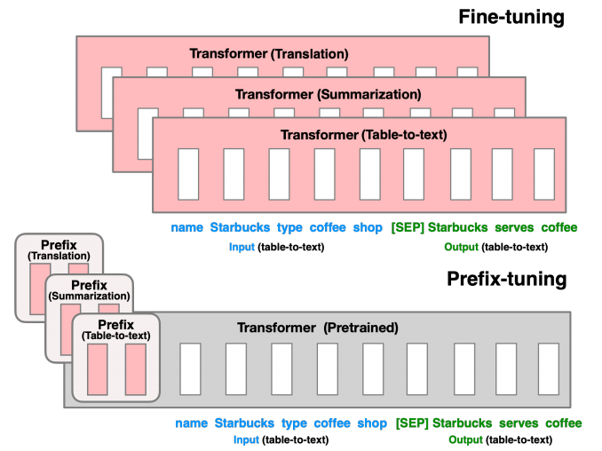
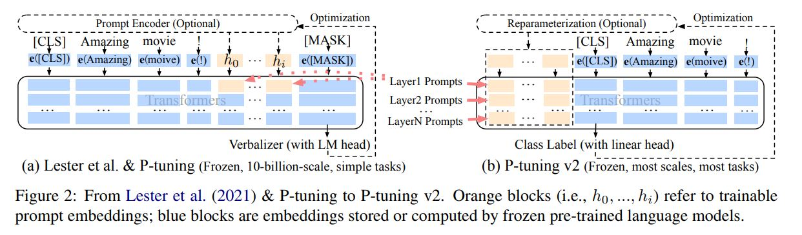

# P-tuning

## 一、prompt 技术简介

1、简要介绍

当我们要训练的模型很大的时候我们会发现，fine-tuning是很难提升模型的效果的，这是因为模型变大的同时，模型的参数也越大，而fine-tuning就是利用数据集去改变模型的weight,所以原模型参数越大、效果越好你需要通过fine-tune的数据就越多，所以，在大模型的训练中更多的使用是prompt的技术。

prompt的提示分为硬提示和软提示。目前主流的方法是软提示。promt是提示学习，而promt-tuning是就是利用软提示的方式来让机器写提示学习。所以promt-tuning可以理解为：

**在Prompt中插入一段task-specific的可以tune的prompt token。**即通过提示学习，让机器写提示语句，然后再生成固定的任务。目前关注点比较多的是如下三个：

- P-tuning：将prompt变成token，用BiLSTM进行学习。
- P-tuning：使用混合的prompt初始化策略（如CLInit和SelectInit）。
- Prefix-tuning：对于不同模型，将prompt注入输入的不同位置。原理图如下：

参考：https://zhuanlan.zhihu.com/p/524383554

## 二、论文简介

### 论文1：https://arxiv.org/pdf/2103.10385.pdf

p-tuuning是一种利用模板训练数据微调，解决gpt等模型对NLU（自然语言理解）效果不佳的过程。具体的过程可以简要的表示为.作者认为MLM（Mask Language Model）可以表示为模板。
$$
T={|P_{0:i},x,P_{i+1:m},y|}
$$
传统的prompt的方法是将T中的每个token隐射为embedding，将生成的通过预训练模型，生成一个完整的分数进行迭代训练。而p-tuning则是利用一个模型将pi迭代为一个可以训练的参数hi，利用hi一起进行迭代训练。

p-tuning的代码细节可以表示为：

- 输入一个句子，以及预先设计的一个离散的模板：`The Disney film is good! It was [MASK].`；

- 先使用BERT的分词工具分词，并获得input ids、position ids、attention masks等；
- 对输入的template中，挑选一个（或多个）token作为pseudo token：`The Disney film is good! [pseudo] was [MASK].`其初始化可以直接使用原本的token embedding；
- 对所有的pseudo token $p_i$ ，喂入一层LSTM，并获得每个pseudo token输出的隐状态向量$h_i$
- 将整个句子喂入BERT embedding layer，对于pseudo token部分的token embedding，则使用$h_i$  进行替换，最后喂入MLM中获得[MASK]位置的预测结果。

参考文献：

https://blog.csdn.net/qq_36426650/article/details/120802305

https://kexue.fm/archives/8295

### 论文2：The Power of Scale for Parameter-Effificient Prompt Tuning

这篇文章讲了一种大模型（T5）进行prompt-tuning的方法，这篇文章大致讲了调优的方法，和上面的论文类似，输入token序列X,Y为class的标记序列。同时为了训练将原始模型的$\theta$进行冻结，只对原模型的embedding层和prompt_token进行参数的迭代。所以模型就有个$p_{\theta}$这个表。

### 论文3:Prefix-Tuning: Optimizing Continuous Prompts for Generation

prefix-tuning为一种轻量级的提示学习方法。

主要思想为：

- **固定预训练模型的参数，只对小部分的参数进行微调。**
- 受到prompt的启发，提出了一种**prefix-tuning**的方法用于生成任务之中。

主要的思想是在输入的token中添加一个前缀向量（prefix）冻结整个预训练模型的同时，只对前缀向量进行迭代。即通过添加的前缀token和transformer的自注意力机制对整个模型进行迭代。

参考：https://blog.51cto.com/u_15919249/5962258

### 论文4：P-Tuning v2: Prompt Tuning Can Be Comparable to Fine-tuning Universally Across Scales and Tasks 

https://arxiv.org/pdf/2110.07602.pdf

之前的p-tuning有两个不足：

（1）可训练的参数太少

（2）embedding的改变对结果影响不直接。

p-tuning v2在p-tuning的基础上做了几个调整

（1）移除了提示的编码器（p-tuning的lstm prefix mlp<多层感知机>），改为了可选的重参数编码器

（2）在每一层 输入和模型层都添加了prefix layer

（3）引入了多任务学习，先在多任务的prompt预训练，然后再适配下游的任务。

（4）抛弃了prompt learning中的vertbalizer,回归到传统的CLS和token label分类范式。

论文还研究了不同prompt length的影响

（1）简单任务：情感分析，prompt长度（~20）就可以完成。

（2）复杂任务：阅读理解，需要更长的prompt（~100）。

参考：

https://zhuanlan.zhihu.com/p/618871247

https://zhuanlan.zhihu.com/p/422713214

https://www.zhihu.com/question/593448472

## 三、项目微调

项目1：利用chatglm进行微调，目前

github:https://github.com/THUDM/ChatGLM-6B/tree/main/ptuning

在这个项目上可以进行训练，但是只能进行单卡训练。

训练数据：广告生成的数据集

| 硬件                   | 模型参数                        | 训练时长 | 数据大小 |
| ---------------------- | ------------------------------- | -------- | -------- |
| rtx3090 一张卡 24G显存 | per_device_train_batch_size 16  | 24h      | 11w      |
| a100 40g               | per_device_train_batch_size 512 | 19分钟   | 11w      |
|                        |                                 |          |          |

训练结果：

- 项目只能使用单卡训练，训练3000个step用时24小时
- loss下降一般，loss由7下降至6.0

微调效果：

在原版的项目微调上会出现灾难性的遗忘。

项目2：

github:https://github.com/liucongg/ChatGLM-Finetuning

在这个项目可以采用deepspeed的方法进行多卡的p-tuning训练

| 硬件          | 模型参数                      | 显存占用 | 训练时长 | 数据大小 |
| ------------- | ----------------------------- | -------- | -------- | -------- |
| a100 40g 双卡 | per_device_train_batch_size 5 | 48*2     | 30分钟   |          |
|               |                               |          |          |          |
|               |                               |          |          |          |

四、相关微调的方法

这是一个对lora、chatglm进行微调的项目

https://github.com/liucongg/ChatGLM-Finetuning