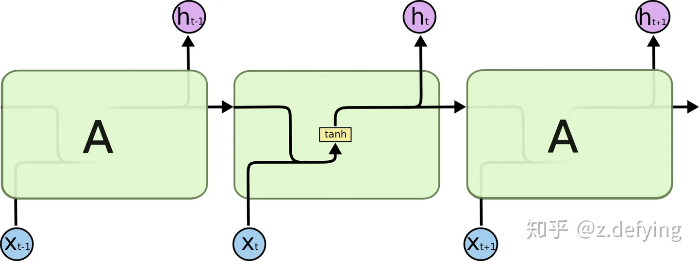
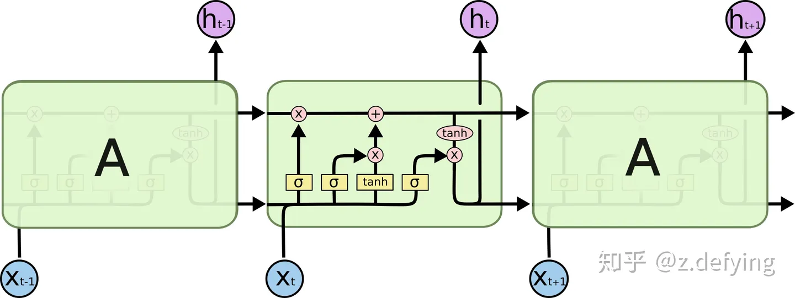

# 一  道通面试

## 1、解释下RNN,RNN对于序列的损失函数是怎么求的。

https://note.youdao.com/s/CFiH28oo

https://zhuanlan.zhihu.com/p/86006495

这里有对RNN的详细介绍。

总结来说，RNN分为普通RNN和利用LSTM长期搭建的LSTM模型。

这里详细介绍下LSTM

LSTMs也有这种链状结构，但是其中的重复模块有不同的结构。它不是只有一个神经网络层，而是有四个，以非常特殊的方式相互作用。

### 1、遗忘门

LSTMs 的第一步是决定要从cell状态中丢弃什么信息，这是由一个被称为“遗忘门”的sigmoid 网络层实现的，遗忘门用来忘记导致错误预测的信息。它的输入为 ℎ_t−1 和 $x_t$，并为cell状态中的每个值输出为一个介于 0 和 1 之间的数字。1 表示“完全保留这个值”，而 0 表示“完全删除这个值”。

它试图根据前面所有的单词来预测下一个单词，这时它根据当前对象的性别信息，来预测正确的代词。当有新对象出现时，就需要忘记之前对象的性别信息。

### 2、输入门

下一步是决定要在cell状态中存储什么新信息。这有两个部分。

首先，tanh 网络层创建一个可以添加到cell状态的向量 Ct；然后 sigmoid 网络层为 Ct中的每个值输出为一个介于 0 和 1 之间的数字，来决定要更新哪些状态值，以及更新程度。

在下一步中，需要结合这两者来创建状态的更新值。

对于语言模型的例子，要在cell状态中加入新对象的性别，以取代要遗忘的旧对象。

### 3、更新门

我们现在知道了遗忘门决定是否遗忘遗忘之前的信息，学习门决定是否更新当前的信息，现在就需要将旧的cell状态 $c_{t-1}$ 更新为新的cell状态 $c_{t}$了。

用旧状态乘以 $f_t$，忘记之前决定忘记的信息；然后加上更新值$i_{t}*c_{t}$。

对于语言模型，就是在cell状态中删除旧对象的性别信息，并添加新对象的性别信息。

### 4、输出门

最后，我们需要决定我们要输出什么，将得到的新的cell神经单元多少东西进行输出。这里为什么之所以要再过一次矩阵变化和激活，我觉得是为了让cell在输出的过程中学到更多的迭代知识。

**总结：**

- 在RNNs的反向传播中，使用计算梯度调整权重矩阵，由于有很多个**偏导数连续相乘**，会使网络中的梯度最终变得太小而消失，或者变得太大而爆炸，这使得RNN难以学习长距离的信息。
- LSTM 中的cell状态（即长期记忆）仅仅需要进行**线性求和**运算就可以通过隐藏层，梯度可以轻松地在网络间移动，而不会衰减。
- LSTM 还可以使神经网络在记忆最近的信息和很久以前的信息之间进行切换，让数据自己决定哪些信息要保留，哪些要忘记。
- LSTM为什么能够记忆长期序列，因为lstm有三个门控系统，这三个门控系统相互作用，每次输入序列时都会被判断是否有重要信息，分为三种（1）发现重要信息，it变大，输入门接近1。（2）没有发现重要信息，ft,遗忘门的阈值变大需要遗忘更多的东西，遗忘门接近0。（3）发现重要信息，且之前的不需要保留，输入门的值接近1，遗忘门的值接近0。即lstm中会有多种值去控制不同的输出，而不想rnn只有一个值去控制输入到输出。参考这个：，lstm对反向导数的传播没有消失的那么快了。 https://zhuanlan.zhihu.com/p/85776566

补充：为什么使用非线性激活函数。

非线性激活函数的存在确实能够使得神经网络的导数不会一直是常数或者特别小的数。这是因为在神经网络的反向传播过程中，梯度是通过链式法则逐层传播的，而非线性激活函数引入了**非线性变换**，使得梯度不会一直以恒定的速率衰减或增大。

具体来说，如果没有激活函数或者使用了线性激活函数（比如恒等激活函数），那么每一层的输出都是上一层输入的**线性变换**，这会导致每一层的**梯度都是常数**，从而在反向传播过程中，梯度可能会出现**消失（变得非常小）或者爆炸（变得非常大）**的情况。

而非线性激活函数能够引入非线性变换，使得神经网络的输出不再是简单的线性变换，而是一个复杂的非线性函数，这样可以使得梯度在反向传播过程中不会一直保持常数或者特别小的数值。因此，非线性激活函数能够帮助神经网络更好地学习和适应复杂的数据分布，避免梯度消失或爆炸的问题，从而提高网络的性能和训练效果。

## 1.2 rnn的序列损失函数的求法。

1、损失计算方法

在训练递归神经网络（RNN）时，通常会使用序列损失函数来衡量模型在整个序列上的预测性能。常见的序列损失函数包括交叉熵损失函数（Cross Entropy Loss）、均方误差损失函数（Mean Squared Error Loss）等。这些损失函数的计算方式与一般的损失函数类似，只是需要考虑整个序列的输出。

以交叉熵损失函数为例，假设有一个序列长度为 T 的输入序列$(x1,x2,...,xT)$，对应的目标序列为 $(y1,y2,...,yT)$，模型的输出序列为。$\hat{y_1}\hat{y_2}，..\hat{y_t},$那么交叉熵损失函数的计算方式如下：
$$
L = -\frac{1}{T} \sum_{t=1}^{T} \sum_{i} y_{t,i} \log(\hat{y}_{t,i})
$$
在使用其他类型的序列损失函数时，只需根据具体的损失函数公式进行计算即可。

需要注意的是，对于循环神经网络（RNN），由于它的特殊结构，通常需要使用技巧如截断反向传播（Truncated Backpropagation Through Time，TBPTT）来处理长序列，以便更有效地训练网络。

2、rnn的反向传播时，是计算1-t时刻的损失一起迭代，没走一步迭代一步。

看情况，如果损失只涉及最后一个序列则是计算所有损失一起迭代。

否则，每一步都需要迭代一次模型。

## 2、有哪些数据降维的方法。

1、PCA主成分分析。

​        其实主成分分析其实就是向量空间的一种表示方法。即我将数据点投射到变量空间中，以正交平移的方法找到能够表示样本空间的最大的几个坐标系。每次以方差最大作为选择，选择前几维度的主成分作为最终的主成分结果。

2特征选择（Feature Selection）

 特征选择是一种简单而直接的降维方法，它通过选择最相关或最有用的特征来减少数据的维度。常用的特征选择方法包括过滤法、包装法和嵌入法等。

如树模型的特征选择，随机森林、xgboost等等。

3、　LDA

　LDA是一种有监督的（supervised）线性降维算法。核心思想：往线性判别超平面的法向量上投影，是的区分度最大（高内聚，低耦合）。LDA是为了使得降维后的数据点尽可能地容易被区分！

https://www.cnblogs.com/guoyaohua/p/8855636.html

## 3、什么是c++的多态

C++中的多态（polymorphism）是面向对象编程中的一个重要概念，它允许不同的类对象对同一个消息做出不同的响应。多态性能够提高代码的灵活性和可扩展性，使得程序更易于维护和扩展。

https://zhuanlan.zhihu.com/p/104605966

## 4、面试中自我介绍的相关问题

（1）之前做过的比较有成就感的项目是什么？当时是什么样的背景，要解决什么问题？这个你做了哪些事情/起到了什么作用？最后对业务/公司/客户产生了什么效果/收益？     

​	你好，应总，我做过比较有成就感的项目主要有两个，一个是公司分词和预处理组件的优化，另一个基于公司的大模型进行产品助手的问答优化。第一个项目是我刚来公司的时候，因为当时公司很多推理产品基于硬件设施和成本的需要，仍然在使用CNN、DPCNN之类的较为传统的机器学习模型，而这类模型推理的过程中，数据预处理和分词占用了整个推理耗时的70%。为了提升公司产品的竞争力，我需要对分词算法进行相应的优化，当时公司使用的jieba分词的算法，我的优化思路是，1、找到市面上已有的分词算法工具进行对比，包括原理和工具，测试速度和分词的精度。2、是否有可以替代的算法进行改。当时对比以后发现jieba的这种分词算法仍然是精度和速度最高的。所以采用思路2，我将整个分词的模块进行计时和分解，发现分词算法中最耗时的是在于他的后向最大分词+DAG的动态规划部分，所以我重点优化这一部分，我利用后向字典树优化了词语查找的速度，利用后向分词省略了DAG动态查找的时间，并且为了减弱后向分词精度的下降，我重新构建了jieba的HMM模型，HMM模型是一个统计模型，我是使用了公司的专用分词词库和jieba训练的词库进行混合训练统计，得到的新的HMM模型。经过这个优化以后使得整体部门的NLP文本处理的推理速度提升1倍以上，而分词精度只下降了1%左右。

​	第二个是我在公司对大模型的产品知识问答进行的优化，首先大模型虽然经过了专用数据的全量和微调，但是在适配公司智能客服这一块仍然有幻觉的问题。为了纠正幻觉问题我采用了外挂知识库的方法对输出进行优化，即客户提问会先经过检索模型在产品知识库中进行检索，将检索的精确内容以提示学习的方式喂入大模型（大模型的特性就是0-shot和few-shot能力）。其中检索模型我才用的faiss的bge模型，但是遇到了两个问题：1、用户提问可能存在多意图。2、bge对特殊产品名称的识别不敏感。用户提问存在多意图我采用的是关键词抽取和实体消歧的方式来进行，找一个公司专用的产品名称的字典，使用hash表对字典进行专用的消歧字典。训练一个命名实体识别的模型专门抽取公司产品的名称，将抽取的实体进行消歧处理并和问题拼接。这样模型在检索时可以通过关键词明中多个文本。第二个问题，bge对产品不敏感，我才用bge的挖掘脚本，从训练数据中找到与提问数据距离的较远的样本作为负样本，问题本身作为正样本，让bge向我们自己的数据集迁移，其次我们在模型训练时嵌入了mask操作，因为bge训练过程也是encoder+decoder的形式，我们提前对预测的句子中的产品实体进行mask操作，使得模型在迭代时能向着产品名称预测的方向迭代，让模型知道我们的产品。

最后为了保证输出的这个有效性，我对大模型做了两个方向的微调，一个是选择模型，利用提示模板从bge的答案进行选择，另外一个进行相应的生成，通过大模型进行答案的整合，整体的bge准确率在产品端检索测试95%，大模型端是97%。

（2） 你最擅长那一块？相对于他人你的优势是什么？

在深度学习的领域内，我可能对数学和统计量的计算更加敏感，因为我之前硕士是统计学专业的研究生，我们进行数学建模和选择的模型会更加有解释性一些，比如之前做的lassco回归，线性回归等等。深度学习以及大模型出来后被人们称为暴力美学，但是可能我在自己进行模型选型或者实验的时候会更多的做一点可解释性的操作。比如我之前做文本分类（textcnn+attention），我就用attention层找出了词语的权重计算，相比于别人来说，我觉得这种对数据和模型的可解释性的研究会帮助我更好的迭代模型，也帮助我能更敏感的发现问题，而且也能为我的一些成果提供理论支撑。

### 4.2  自我介绍

​	面试官你好，我叫彭闯，今年30岁，目前在西安工作与定居。下面我将从学历和工作经历两方面做一个自我介绍。我是硕士学历，本科就读于陕西师范大学的金融学，有一定的金融理论知识和数学的基本功底，硕士就读于南京邮电大学的应用统计专业，期间学习了python编程、统计学、机器学习、深度学习等多种课程。在校期间获得过全国大学生统计建模大赛和全国大学生数学竞赛的奖项。

​       我的工作经历主要分为分为两段，一段是我的实习经历，是在2019年6月-2019年12月在南京烽火从事数据挖掘的工作，当时的职责是数据分析师，另一段是从2020年6月至今，在厦门美亚柏科从事算法工程师的相关工作，这一段工作经历大致可以分为四个部分。第一个部分是做公司基础nlp组件的优化与加速，说下背景（）

第三个部分是帮助公司搭建了一个小型的gpt智能分析模块。其中主要包括两部分工作，一个是将文本内容抽取转为表内的查询内容，这个任务我是采用图数据库建立相应的表内关系图谱，并通过bert-wwm模型训练了一个texttosql的seqtoseq的文本生成模型。第二个任务是做了一个文本分类+实体识别的综合模型，能够输出文本的询问意图与重要的实体内容。

第四部分是参与了公司天擎大模型的训练。这一部门的内容大致分为四个部分：第一，前期模型的选择，微调方式的调研，确定了base模型的选项。

第二，参与了大模型训练与微调，包括数据的收集、清洗，训练的数据量与整体的数据分布等等。大模型经过了全量调参与微调这两个步骤。得到了第一版天擎模型。

第三，以公司大模型为基座，负责了公司的智能客服的AI模型的研发。利用外挂知识库的方式优化了产品问答的准确率。

## 4.3 你有什么金融类的数据分析的经验吗

​		之前做过信用卡评分模型的搭建，主要使用的是随机森林和logit回归模型做的。这个是当时的一个课程作业，我用的是一个金融比赛的数据集，主要是利用人物的各个特征判断当事人是否存在信用卡违约风险的案例。我是先用随机森林的模型对人物特征进行相应筛选，数据集中的自变量应该很多，通过阈值设定选择人物中较为重要的因子作为建模的变量。训练采用的logit回归模型，根据人物的数据特征给与相应的违约与不违约的概率。最后利用统计量将其隐射到一个具体的分数。odd值每次翻倍我会扣150，当违约概率大于0.5时设置一个警戒线。

## 4.4  移动研究院--测试岗的内容

1、说一下sql中有哪些主键

主键是sql数据库中数据的唯一的标识。

sql中的主键主要分为三种：

（1）单一字段的主键：即数据库中设置的唯一的键值。一般以其中的一个字段 作为一个主键。

（2）复合主键：复合主键是由多个字段组成，即用多个键值作为数据库的联合唯一的标识。

（3）外键：外键不是主键本身，是外表建立关系的键，外键可以与外表形成一对一或者一对多的关系。

2、sql中主键和索引的区别

- 主键是一种用于唯一标识表中每一行数据的字段或字段组合。它保证表中的每一行都具有唯一的标识符。
- 主键具有以下特点：
  - 唯一性：表中的每一行都必须具有唯一的主键值，不能有重复值。
  - 非空性：主键值不能为空值（NULL）。
  - 不可变性：一旦设定，主键值不可更改。

主键也是一种特殊的**索引**

索引和主键是不同的，索引是物理的键值，主要作用是**加快数据库的检索速度**，它可以通过创建额外的数据结构来加快数据检索速度，索引是个**物理键值**，创建表时就有了

区别：

1、创建主键时一定包括一个唯一的索引，但是有索引不一定有主键。

2、索引允许空值，主键不允许。

3、主键可以被其他表引用为外键，但是唯一索引不能。

4、一个表只能创建一个唯一主键，但是可以创建**多个唯一索引**。

5、主键是人为创建的，但是索引是**物理键**，是在主键创建以后生成的。

2、有两个沙漏，一个3分钟的，一个4分钟的，如何用两个沙漏确定5分钟的时间。

先将3分钟和4分钟的沙漏倒过来，当3分钟沙漏漏完时，4分钟还有1分钟时间，这时将3分钟沙漏倒过来存储1分钟的时间，等4分钟沙漏漏完，将3分钟的沙漏倒过来将1分钟的时间加上。

​	

